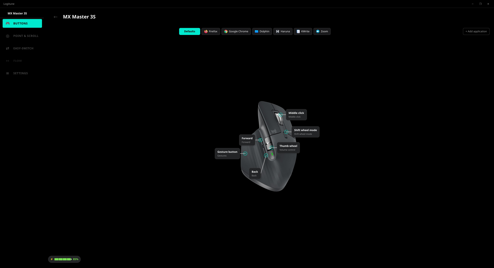
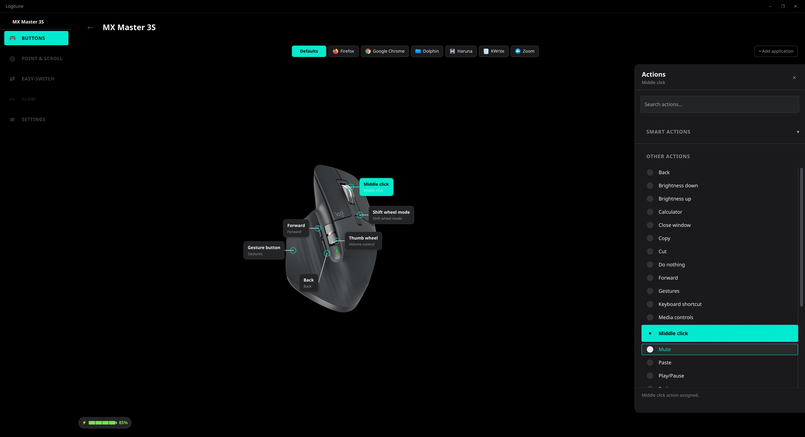
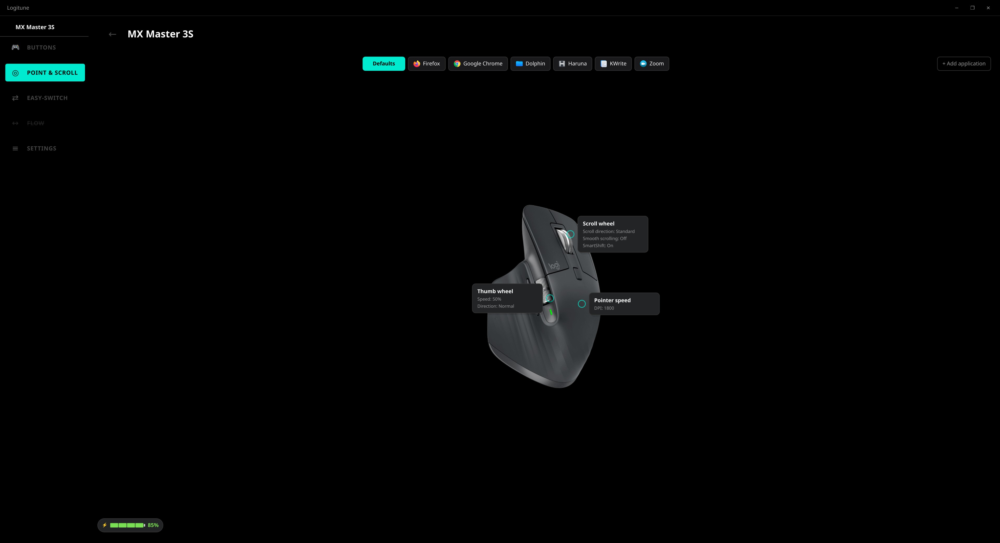
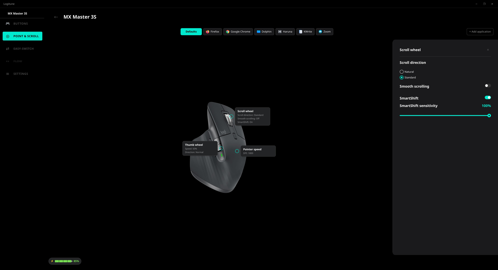
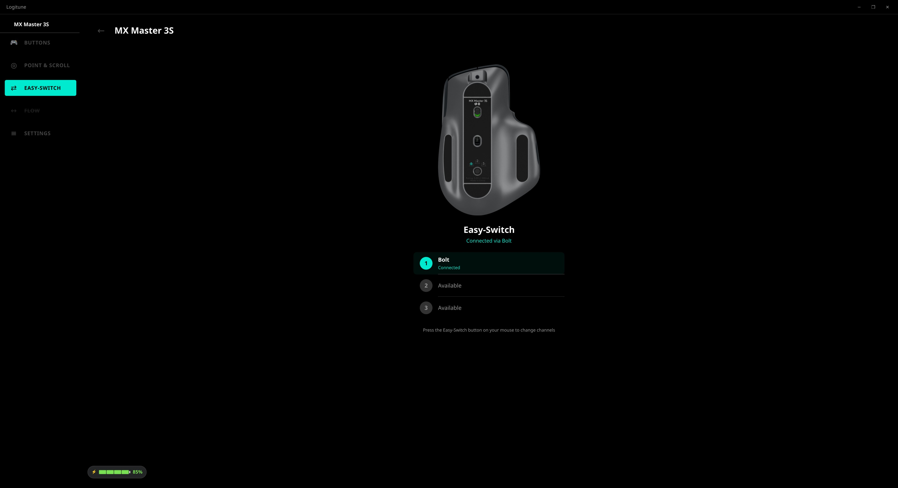
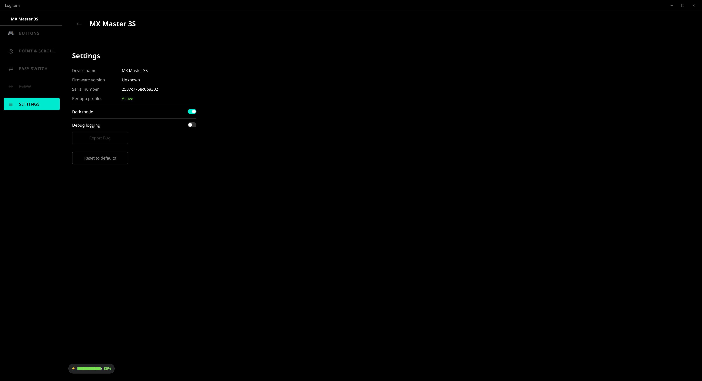

<p align="center">
  
  <h1 align="center">Logitune</h1>
  <p align="center">A Linux configurator for Logitech peripherals — per-application profiles, gesture mapping, thumb wheel modes, and a dark-themed Qt Quick UI matching Logitech Options+.</p>
</p>

<p align="center">
  <a href="https://github.com/mmaher88/logitune/actions/workflows/ci.yml"></a>
  
  
  
  
</p>

<p align="center">
  
</p>

## ✨ Features

- 🖱️ **Per-app profiles** — automatic button/scroll/DPI switching on window focus
- ⌨️ **Button remapping** — keystrokes, media controls, app launch, gestures, SmartShift toggle
- 🎛️ **Thumb wheel modes** — volume, zoom, horizontal scroll with invert control
- 👆 **Gesture support** — hold + swipe for desktop switching, task view, custom keystrokes
- ⚡ **DPI / SmartShift / Scroll** — full control with live preview
- 🔋 **System tray** — battery status, minimize to tray
- 📡 **HID++ 2.0** — direct communication via Bolt receiver, no daemon needed
- 🔄 **Disconnect/reconnect** — automatic re-enumeration and profile reapplication
- 🖥️ **KDE + GNOME** — native focus tracking on both desktops
- 🛠️ **In-app descriptor editor**: launch with `--edit` to position hotspots, upload images, and tune labels without hand-editing JSON. [Learn more](https://github.com/mmaher88/logitune/wiki/Editor-Mode)

## 📸 Screenshots

<p align="center">
  
  <br>
  <em>Action selection panel</em>
</p>

<details>
<summary><strong>More screenshots</strong></summary>

<p align="center">
  
  <br>
  <em>Scroll, thumb wheel &amp; pointer speed</em>
</p>

<p align="center">
  
  <br>
  <em>Scroll direction, SmartShift, smooth scrolling</em>
</p>

<p align="center">
  
  <br>
  <em>Easy-Switch channel management</em>
</p>

<p align="center">
  
  <br>
  <em>Device info, dark mode, debug logging</em>
</p>

</details>

## 🚀 Install

**Ubuntu 24.04 (via OBS repo):**
```bash
echo 'deb http://download.opensuse.org/repositories/home:/mmaher88:/logitune/xUbuntu_24.04/ /' | sudo tee /etc/apt/sources.list.d/logitune.list
wget -qO- https://download.opensuse.org/repositories/home:mmaher88:logitune/xUbuntu_24.04/Release.key | gpg --dearmor | sudo tee /etc/apt/trusted.gpg.d/logitune.gpg > /dev/null
sudo apt update && sudo apt install logitune
```

**Fedora 42 (via OBS repo):**
```bash
sudo dnf config-manager addrepo --from-repofile=https://download.opensuse.org/repositories/home:mmaher88:logitune/Fedora_42/home:mmaher88:logitune.repo
sudo dnf install logitune
```

**Arch Linux (AUR):**
```bash
yay -S logitune
```

**From source:**
```bash
cmake -B build -G Ninja -DCMAKE_BUILD_TYPE=Release -DCMAKE_INSTALL_PREFIX=/usr
cmake --build build
sudo cmake --install build
logitune
```

## 📚 Documentation

| Guide | Description |
|-------|-------------|
| [🏁 Getting Started](https://github.com/mmaher88/logitune/wiki/Getting-Started) | Installation, permissions, UI overview |
| [🔨 Building](https://github.com/mmaher88/logitune/wiki/Building) | Prerequisites, build commands, native packages, devcontainer |
| [🏗️ Architecture](https://github.com/mmaher88/logitune/wiki/Architecture) | System design, signal flow, 14 Mermaid diagrams |
| [🖱️ Adding a Device](https://github.com/mmaher88/logitune/wiki/Adding-a-Device) | Step-by-step guide with code examples |
| [🖥️ Adding a Desktop Environment](https://github.com/mmaher88/logitune/wiki/Adding-a-Desktop-Environment) | KDE + GNOME implementation, adding new DEs |
| [🧪 Testing](https://github.com/mmaher88/logitune/wiki/Testing) | Philosophy, 4 test tiers, writing tests |
| [📡 HID++ Protocol](https://github.com/mmaher88/logitune/wiki/HID++-Protocol) | Report format, features, Bolt receiver, async matching |
| [🤝 Contributing](https://github.com/mmaher88/logitune/wiki/Contributing) | Workflow, code style, commit format |

## 🖱️ Supported Devices

| Device | Status | Battery | DPI | SmartShift | Thumb wheel | Button remap | Gestures | Smooth scroll | Easy-Switch |
|--------|:------:|:------:|:---:|:----------:|:-----------:|:------------:|:--------:|:-------------:|:-----------:|
| MX Master 3S | ✅ Verified | ✅ | ✅ | ✅ | ✅ | ✅ | ✅ | ✅ | ✅ |
| MX Master 2S | ✅ Verified | ✅ | ✅ | ✅ | ✅ | ✅ | ✅ | ✅ | ✅ |
| MX Master 4  | ✅ Verified | ✅ | ✅ | ✅ | ✅ | ✅ | ✅ | ⚠️ off | ✅ |
| MX Anywhere 3S              | 🧪 Beta     | ✅ | ✅ | ✅ | — | ✅ | — | ✅ | ✅ |
| MX Anywhere 3S for Business | 🧪 Beta     | ✅ | ✅ | ✅ | — | ✅ | — | ✅ | ✅ |
| MX Anywhere 3               | 🧪 Beta     | ✅ | ✅ | ✅ | — | ✅ | — | ✅ | ✅ |
| MX Anywhere 3 for Business  | 🧪 Beta     | ✅ | ✅ | ✅ | — | ✅ | — | ✅ | ✅ |

> **MX Master 4 smooth scrolling** is disabled in the shipped descriptor: the hardware does not respond correctly to the HID++ configuration used on MX Master 2S / 3S. Regular scroll wheel and SmartShift work normally; only sub-tick smoothing is unavailable. Re-enable yourself by setting `"smoothScroll": true` in `devices/mx-master-4/descriptor.json` if your unit behaves differently; if it works we will promote the default.

The four MX Anywhere family descriptors ship as 🧪 **Beta** pending hardware confirmation. Issue [#46](https://github.com/mmaher88/logitune/issues/46) tracks the verification.

Other Logitech HID++ 2.0 devices can be added by contributing a [device descriptor](https://github.com/mmaher88/logitune/wiki/Adding-a-Device). See [Device Support Status](https://github.com/mmaher88/logitune/wiki/Getting-Started#device-support-status) for what the badges mean.

## 🖥️ Desktop Environment Support

| Feature | KDE Plasma 6 | GNOME 42+ (Wayland) | Other DEs |
|---------|:---:|:---:|:---:|
| Button remapping | ✅ | ✅ | ✅ |
| Media controls | ✅ | ✅ | ✅ |
| DPI / SmartShift / Scroll | ✅ | ✅ | ✅ |
| Thumb wheel modes | ✅ | ✅ | ✅ |
| Gesture actions | ✅ | ✅ | ✅ |
| Per-app profiles | ✅ | ✅ | ❌ |
| Auto profile switching | ✅ | ✅ | ❌ |
| Block shortcuts during capture | ✅ | ✅ | ❌ |
| System tray | ✅ | ✅ | ✅ |

> **Note:** All device configuration (buttons, DPI, scroll, gestures, thumb wheel) works on every DE — it's pure HID++ over hidraw. Per-app profile switching requires desktop-specific focus tracking. KDE uses a KWin script, GNOME uses a Shell extension (auto-installed on first run). See [Adding a Desktop Environment](https://github.com/mmaher88/logitune/wiki/Adding-a-Desktop-Environment) to contribute support for other DEs.

## 🛠️ Tech Stack

C++20 · Qt 6 Quick · CMake · HID++ 2.0 · GTest

## 📄 License

[GPL-3.0-only](https://spdx.org/licenses/GPL-3.0-only.html)
