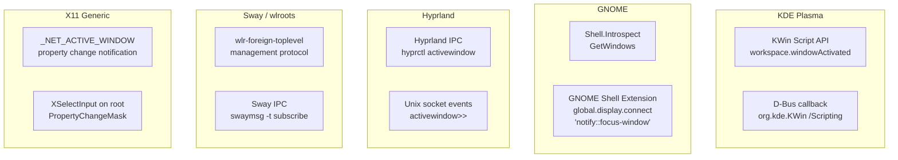

# Adding a Desktop Environment

Logitune uses per-application profiles that switch automatically when window focus changes. This requires desktop environment integration for focus tracking. This guide explains how to add support for a new DE.

## Interface

All desktop integrations implement `IDesktopIntegration` (defined in `src/core/interfaces/IDesktopIntegration.h`):

```cpp
class IDesktopIntegration : public QObject {
    Q_OBJECT
public:
    virtual void start() = 0;
    virtual bool available() const = 0;
    virtual QString desktopName() const = 0;
    virtual QStringList detectedCompositors() const = 0;
    virtual QString variantKey() const = 0;
    virtual std::optional<ButtonAction> resolveNamedAction(const QString &id) const = 0;
    virtual void blockGlobalShortcuts(bool block) = 0;
    virtual QVariantList runningApplications() const = 0;

signals:
    void activeWindowChanged(const QString &wmClass, const QString &title);
};
```

### Required Methods

| Method | Purpose | When Called |
|--------|---------|------------|
| `start()` | Initialize focus tracking (install scripts, connect signals, start polling) | Once, after AppRoot::init() |
| `available()` | Return true if this DE is detected and usable | Checked before relying on DE features |
| `desktopName()` | Human-readable name (e.g., "KDE", "GNOME") | Logging and UI |
| `detectedCompositors()` | List of detected compositor names | Diagnostics |
| `variantKey()` | Short string key matching a top-level key under `variants` in `actions.json` (e.g. `"kde"`, `"gnome"`, `"hyprland"`, `"generic"`). | Read by `ActionFilterModel` per row, by `ActionPresetRegistry::supportedBy` queries. |
| `resolveNamedAction(id)` | Turn a semantic preset id into a concrete `ButtonAction`, or `nullopt` if this DE cannot resolve it. | Called by `ButtonActionDispatcher` on every button press with a `PresetRef` action, and by `ActionFilterModel` at filter time to grey out presets whose live binding is empty. |
| `blockGlobalShortcuts(bool)` | Temporarily disable global shortcuts during keystroke capture | During KeystrokeCapture QML component |
| `runningApplications()` | Return list of installed GUI applications | App profile picker dialog |

### The Critical Signal

```cpp
void activeWindowChanged(const QString &wmClass, const QString &title);
```

This signal drives the entire profile switching system. `wmClass` must be a **stable, unique identifier** for the application. On KDE, this is the `.desktop` file's `completeBaseName` (e.g., `org.kde.dolphin`). On other DEs, it might be the X11 `WM_CLASS` or a Wayland `app_id`.

## Existing Implementations

### KDeDesktop

The KDE implementation (`src/core/desktop/KDeDesktop.h/cpp`) uses:

1. **KWin Script** — a JavaScript snippet loaded into KWin via D-Bus that calls back on `workspace.windowActivated`
2. **D-Bus callback** — the script calls `com.logitune.app /FocusWatcher focusChanged(resourceClass, title, desktopFileName)`
3. **Desktop file resolution** — maps `resourceClass` to canonical `.desktop` file baseName
4. **kglobalaccel D-Bus** — blocks global shortcuts during keystroke capture

### GenericDesktop

The generic fallback (`src/core/desktop/GenericDesktop.h/cpp`) provides a minimal implementation. It is used when no specific DE is detected.

## Step-by-Step: Adding GNOME Support

### Step 1: Create the class

Create `src/core/desktop/GnomeDesktop.h`:

```cpp
#pragma once
#include "interfaces/IDesktopIntegration.h"
#include <QDBusInterface>
#include <QTimer>

namespace logitune {

class GnomeDesktop : public IDesktopIntegration {
    Q_OBJECT
public:
    explicit GnomeDesktop(QObject *parent = nullptr);

    void start() override;
    bool available() const override;
    QString desktopName() const override;
    QStringList detectedCompositors() const override;
    void blockGlobalShortcuts(bool block) override;
    QVariantList runningApplications() const override;

private:
    bool m_available = false;
    QString m_lastAppId;
    QTimer *m_pollTimer = nullptr;

    void pollActiveWindow();
    QString resolveAppId(const QString &wmClass) const;
};

} // namespace logitune
```

### Step 2: Implement focus tracking

> **Note — GNOME Wayland only.** The shipped `GnomeDesktop` refuses to start on X11 sessions (`XDG_SESSION_TYPE != "wayland"`). The pattern below assumes Wayland; if you want X11 support, fall back to the `GenericDesktop` polling loop.

The real `GnomeDesktop` uses an event-driven approach: a small GNOME Shell extension watches `global.display::notify::focus-window` and calls back into the app via D-Bus. No polling. The app auto-installs and enables the extension on first run, then registers `com.logitune.app` / `/FocusWatcher` on the session bus for the extension to call.

Key pieces (all already in-tree):

- **`src/core/desktop/GnomeDesktop.{h,cpp}`** — the C++ integration class. See `GnomeDesktop::start()` for session-type check, `ensureExtensionInstalled()` for the install flow (system dir → user dir copy), `detectAppIndicatorStatus()` for tray-icon support detection via `org.kde.StatusNotifierWatcher`.
- **`data/gnome-extension/`** — the Shell extension source, with v42 and v45 variants for the two GNOME Shell extension API generations.

Create `src/core/desktop/<DE>Desktop.cpp` using the same shape:

```cpp
#include "desktop/<DE>Desktop.h"
#include "logging/LogManager.h"
#include <QDBusConnection>
#include <QDBusConnectionInterface>
#include <QDBusMessage>
#include <QProcessEnvironment>

namespace logitune {

<DE>Desktop::<DE>Desktop(QObject *parent)
    : LinuxDesktopBase(parent)
{
}

void <DE>Desktop::start()
{
    // 1. Sanity-check the session — bail if this DE isn't actually running
    //    or if the session type is wrong for your focus API.
    // 2. If you need a Shell extension / KWin script / wlr protocol,
    //    install or activate it here.
    // 3. Register your D-Bus callback so the DE-side agent can call
    //    back into the app with focus events. focusChanged() is
    //    inherited from LinuxDesktopBase and does the desktop-file
    //    resolution + duplicate suppression.
    //
    // See GnomeDesktop::start() for a complete worked example.
    m_available = true;
}

bool GnomeDesktop::available() const
{
    return m_available;
}

QString GnomeDesktop::desktopName() const
{
    return QStringLiteral("GNOME");
}

QStringList GnomeDesktop::detectedCompositors() const
{
    QStringList compositors;
    const QString desktop = QProcessEnvironment::systemEnvironment()
                                .value(QStringLiteral("XDG_CURRENT_DESKTOP"));
    if (desktop.contains(QStringLiteral("GNOME"), Qt::CaseInsensitive))
        compositors << QStringLiteral("Mutter");
    return compositors;
}

// focusChanged() is the D-Bus entry point the DE-side agent calls.
// LinuxDesktopBase provides resolveDesktopFile() + duplicate-event
// suppression, so subclasses only implement the DE-specific glue.
void <DE>Desktop::focusChanged(const QString &appId, const QString &title)
{
    QString resolved = appId;
    if (!appId.contains('.'))
        resolved = resolveDesktopFile(appId);
    if (resolved == m_lastAppId) return;
    m_lastAppId = resolved;
    emit activeWindowChanged(resolved, title);
}

// runningApplications() is inherited from LinuxDesktopBase — do not
// reimplement unless your DE has a faster dedicated API.

} // namespace logitune
```

### Step 3: Focus Tracking Strategies

Different DEs offer different APIs for tracking window focus:



| DE | Recommended Approach | Latency | Reliability |
|----|---------------------|---------|-------------|
| KDE Plasma 6 | KWin script D-Bus callback | <10ms | High (event-driven) |
| GNOME 45+ | Shell.Introspect polling or Extension | ~500ms (poll) / <10ms (extension) | Medium / High |
| Hyprland | IPC socket subscription | <10ms | High |
| Sway | IPC subscription | <10ms | High |
| X11 (any) | `_NET_ACTIVE_WINDOW` via XCB | <10ms | High |

### Step 4: Window Identity Resolution

The trickiest part of desktop integration is resolving a window to a stable application ID. Different compositors report different identifiers:

| Compositor | Identifier | Example |
|-----------|------------|---------|
| KWin (Wayland) | `desktopFileName` or `resourceClass` | `org.kde.dolphin` or `dolphin` |
| Mutter (GNOME) | `app-id` (from Wayland) | `org.gnome.Nautilus` |
| Hyprland | `class` | `firefox` |
| X11 | `WM_CLASS` (instance, class) | `Navigator`, `firefox` |

Logitune normalizes all of these to a `.desktop` file baseName. The `resolveDesktopFile()` method on `LinuxDesktopBase` (inherited by both `KDeDesktop` and `GnomeDesktop`) does this by:

1. Checking `desktopFileName` if the compositor provides it directly
2. Searching `.desktop` files for a matching filename component
3. Searching `.desktop` files for a matching `StartupWMClass`
4. Falling back to the raw identifier

This logic lives in `LinuxDesktopBase` so every Linux DE implementation inherits it for free — `runningApplications()` and `desktopDirs()` are in the same base class.

### Step 5: Register in AppRoot

Edit `src/app/AppRoot.cpp` to select the right desktop integration:

```cpp
AppRoot::AppRoot(IDesktopIntegration *desktop, IInputInjector *injector, QObject *parent)
    : QObject(parent)
    , m_deviceManager(&m_registry)
    , m_actionExecutor(nullptr)
{
    if (desktop) {
        m_desktop = desktop;
    } else {
        // Detect desktop environment and create appropriate integration
        QString xdgDesktop = QProcessEnvironment::systemEnvironment()
                                 .value("XDG_CURRENT_DESKTOP");
        if (xdgDesktop.contains("KDE", Qt::CaseInsensitive)) {
            m_ownedDesktop = std::make_unique<KDeDesktop>();
        } else if (xdgDesktop.contains("GNOME", Qt::CaseInsensitive)) {
            m_ownedDesktop = std::make_unique<GnomeDesktop>();
        } else {
            m_ownedDesktop = std::make_unique<GenericDesktop>();
        }
        m_desktop = m_ownedDesktop.get();
    }
    // ... rest unchanged
}
```

### Step 6: Add to CMakeLists.txt

Edit `src/core/CMakeLists.txt`:

```cmake
target_sources(logitune-core PRIVATE
    # ... existing files ...
    desktop/KDeDesktop.cpp
    desktop/GenericDesktop.cpp
    desktop/GnomeDesktop.cpp    # Add this
)
```

### Step 7: Testing

The mock infrastructure is already DE-agnostic. `MockDesktop` implements `IDesktopIntegration` and provides `simulateFocus()` to trigger focus changes in tests. No DE-specific test infrastructure is needed.

However, you should add a test for the detection logic:

```cpp
TEST(DesktopDetectionTest, GnomeDetected) {
    // Set XDG_CURRENT_DESKTOP to GNOME and verify GnomeDesktop is created
    // (This may require environment variable manipulation)
}
```

## Preset Resolution

Logitune's action picker includes DE-specific semantic presets (Show desktop, Task switcher, Switch desktop left/right, Screenshot, Close window, Calculator). Each preset is resolved to a concrete keystroke, DBus call, or app launch by the active `IDesktopIntegration` impl.

A new DE impl needs to implement two virtuals:

### variantKey()

Return a short, lowercase string that matches a top-level key in `src/core/actions/actions.json`'s `variants` map. Existing keys: `"kde"`, `"gnome"`, `"generic"`. For a new DE, pick a distinctive key and add matching entries to each preset's `variants` object in `actions.json`. The key does not need to match `desktopName()`.

### resolveNamedAction(id)

Return `std::optional<ButtonAction>`:
- `std::nullopt` - "this DE cannot resolve this preset right now". The action picker hides the row; at fire time the dispatcher logs and does nothing.
- A populated `ButtonAction` - a concrete `Keystroke`, `DBus`, `AppLaunch`, or `Media` action the executor can fire.

The DE impl gets a non-owning pointer to `ActionPresetRegistry` via `setPresetRegistry()` (called once by `AppRoot` at composition time). At resolve time, read `m_registry->variantData(id, variantKey())` to get the hint JSON, branch on the hint kind, and build the concrete `ButtonAction`.

### Example: KDE

KDE's `kglobalaccel` lets callers invoke actions by name over DBus regardless of what keystroke the user has bound. So the KDE impl packs the component + action name into a 5-field DBus payload and returns a `ButtonAction{DBus, ...}`:

```cpp
std::optional<ButtonAction> KDeDesktop::resolveNamedAction(const QString &id) const
{
    if (!m_registry) return std::nullopt;
    const QJsonObject variant = m_registry->variantData(id, QStringLiteral("kde"));
    if (variant.isEmpty()) return std::nullopt;

    if (variant.contains(QStringLiteral("kglobalaccel"))) {
        const QJsonObject spec = variant.value(QStringLiteral("kglobalaccel")).toObject();
        const QString component = spec.value(QStringLiteral("component")).toString();
        const QString name = spec.value(QStringLiteral("name")).toString();
        if (component.isEmpty() || name.isEmpty()) return std::nullopt;

        const QString payload =
            QStringLiteral("org.kde.kglobalaccel,/component/") + component +
            QStringLiteral(",org.kde.kglobalaccel.Component,invokeShortcut,") + name;
        return ButtonAction{ButtonAction::DBus, payload};
    }
    // ... app-launch branch
    return std::nullopt;
}
```

### Example: GNOME

GNOME has no binding-independent invoker for most actions, so the GNOME impl reads the user's current binding from `gsettings`, translates the GLib variant output (`['<Super>d']`) into Logitune keystroke format (`Super+d`), and returns `ButtonAction{Keystroke, ...}`. Empty binding returns `nullopt`. Uses an injectable `std::function` reader for tests so unit tests do not fork QProcess.

### Example: Hyprland / Sway / i3

Hyprland support uses IPC for focus tracking and live bind inspection for presets. The C++ integration listens to Hyprland's event socket for `activewindow` events and queries `j/binds` from the command socket when resolving supported semantic presets. A preset only appears when a matching keyboard bind exists in the default submap; unsupported or unbound presets return `nullopt`.

### If your DE does not support some presets

Leave its variant out of those entries in `actions.json`. `ActionPresetRegistry::supportedBy(id, variantKey)` then returns false and the action picker hides the row on your DE. Users on your DE simply do not see presets that cannot work there.

### Generic fallback

`GenericDesktop::resolveNamedAction` returns `std::nullopt` for every id. No preset has a `"generic"` variant today, because every semantic action in scope needs a DE-native invoker to be reliable. Media keys / alt+tab / XF86 keysyms are handled as raw `Keystroke` actions in the existing catalog, not as presets.

### Extracting Shared Utilities

If you are adding a second DE implementation, consider extracting these shared utilities:

1. **`resolveDesktopFile()`** — `.desktop` file lookup by resourceClass/StartupWMClass
2. **`runningApplications()`** — scanning `.desktop` files for GUI applications
3. **Desktop directory list** — `/usr/share/applications`, `~/.local/share/applications`, Flatpak/Snap paths, etc.

These could live in a `DesktopUtils` static class or be moved to the `GenericDesktop` base class.

## Outline: Adding Hyprland Support

Hyprland is a wlroots-based compositor with a powerful IPC system. Here is a brief outline:

1. **Class**: `HyprlandDesktop` extending `LinuxDesktopBase`
2. **Focus tracking**: Subscribe to Hyprland IPC socket (`$XDG_RUNTIME_DIR/hypr/$HYPRLAND_INSTANCE_SIGNATURE/.socket2.sock`) for `activewindow>>` events
3. **Window identity**: Hyprland reports the `class` property, equivalent to X11 `WM_CLASS`. Run through `resolveDesktopFile()`.
4. **Preset resolution**: Query `j/binds` from the Hyprland command socket and map matching keyboard binds to Logitune `Keystroke` payloads.
5. **blockGlobalShortcuts**: Leave as a no-op unless Hyprland gains a stable compositor-wide shortcut-block API.
6. **Detection**: Check `XDG_CURRENT_DESKTOP` for `Hyprland` or `HYPRLAND_INSTANCE_SIGNATURE`.

The Hyprland IPC approach is event-driven (no polling), making focus tracking efficient and low latency.
