# Architecture

Logitune is a Qt 6 / QML application that communicates with Logitech HID++ 2.0 devices through the Linux hidraw subsystem. This page documents the system design, signal flow, protocol layer, and key architectural decisions.

## System Overview

At a glance, one button press on the mouse turns into one row update in the QML UI. Each layer has one job, and `AppRoot` is a thin composition root that wires them together (not a place where behavior lives):


> Source: `docs/wiki/diagrams/system-overview.svg`. Re-render with `rsvg-convert -w 1600 -h 1240 docs/wiki/diagrams/system-overview.svg -o docs/wiki/diagrams/system-overview.png` after edits.

The app-lib band contains AppRoot plus four focused services (`ActiveDeviceResolver`, `DeviceCommandHandler`, `ButtonActionDispatcher`, `ProfileOrchestrator`) that sit between the QML UI / ViewModels and the core library's engines + HID++ stack. Each layer below has its own detailed diagram elsewhere on this page:

| Layer | Detail |
|---|---|
| Core — HID++ stack | [HID++ protocol stack](#stack), [feature discovery](#feature-discovery), [command processor](#command-processor), [async matching](#async-response-matching) |
| Core — Desktop integration | [Interface hierarchy](#interface-hierarchy), [KDE focus tracking](#kde-focus-tracking) |
| Core — Device lifecycle | [PhysicalDevice transport aggregation](#physicaldevice-transport-aggregation), [Discovery flow](#discovery-flow), [Disconnect and reconnect](#disconnect-and-reconnect) |
| App — Services | [Services](#services) |
| App — Models | [MVVM pattern](#mvvm-pattern), [Model roles](#model-roles), [Model registration](#model-registration) |
| App — Composition root | [AppRoot wiring](#approot-wiring) |
| Cross-cutting flow | [Window focus → profile switch → hardware commands](#window-focus-change---profile-switch---hardware-commands) |

### Two Static Libraries

The project is split into two static libraries:

| Library | Contents | Dependencies |
|---------|----------|-------------|
| `logitune-core` | DeviceManager, `PhysicalDevice`, `DeviceSession`, HID++ protocol + capability dispatch, ProfileEngine, ActionExecutor, `DeviceRegistry`, `JsonDevice`, `DescriptorWriter`, `LinuxDesktopBase` + KDE/GNOME/Generic implementations, input injection, logging | Qt6::Core, Qt6::DBus, libudev |
| `logitune-app-lib` | AppRoot, `EditorModel`, models (DeviceModel, ButtonModel, ActionModel, `ActionFilterModel`, ProfileModel, `SettingsModel`), TrayManager, QML module, dialogs | logitune-core, Qt6::Quick, Qt6::Widgets |

This split allows tests to link against `logitune-core` and `logitune-app-lib` without pulling in the executable's `main()`.

## Signal Flow

### Window Focus Change -> Profile Switch -> Hardware Commands

This is the central flow of the application. When the user switches to a different window, the active profile changes and hardware settings are updated.

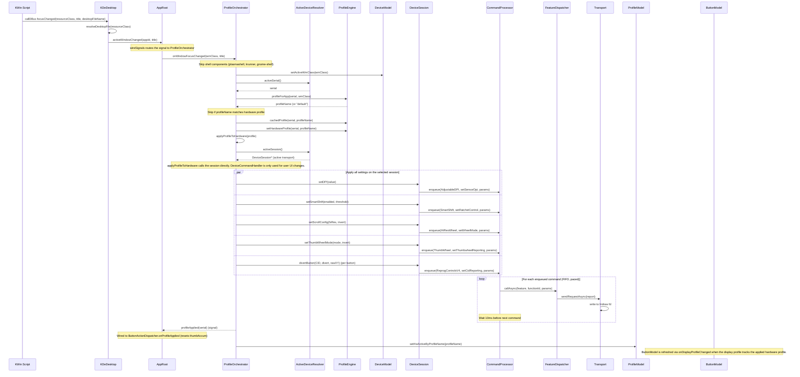

### Key Design Decision: Display vs Hardware Profile

The ProfileEngine maintains two independent profile pointers:

- **displayProfile** — the profile the user is currently viewing/editing in the UI
- **hardwareProfile** — the profile currently applied to the device hardware

These can differ. When the user clicks a profile tab, only the display profile changes (UI updates, no hardware writes). When the focused window changes, the hardware profile changes (hardware writes, and if the user was viewing a different tab, the UI stays on that tab).

This prevents accidental hardware writes when the user is just browsing profiles.

## HID++ Protocol Layer

### Stack

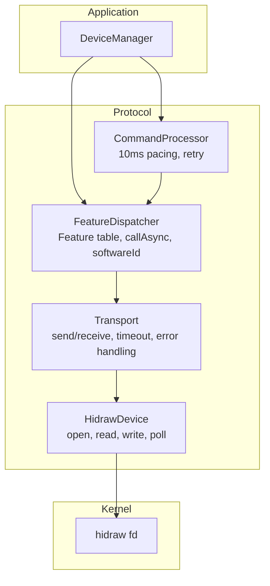

### Feature Discovery

On device connect, `FeatureDispatcher::enumerate()` queries the Root feature (0x0000) to build a feature index table:

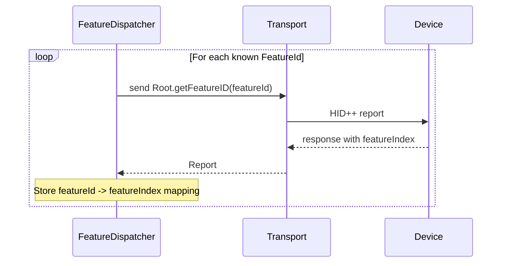

The feature table maps `FeatureId` enums to device-assigned 8-bit indices. For example, `FeatureId::AdjustableDPI (0x2201)` might map to index `0x07` on one device and `0x09` on another. All subsequent calls use the resolved index.

Known features (from `HidppTypes.h`):

| Feature | ID | Description |
|---------|-----|-------------|
| Root | `0x0000` | Feature discovery |
| FeatureSet | `0x0001` | List all features |
| DeviceName | `0x0005` | Read device name string |
| BatteryStatus | `0x1000` | Battery level (legacy format, MX Master 2S and older) |
| BatteryUnified | `0x1004` | Battery level and charging status (MX Master 3S+) |
| ChangeHost | `0x1814` | Easy-Switch host info |
| ReprogControlsV4 | `0x1b04` | Button diversion and remapping |
| SmartShift | `0x2110` | SmartShift V1 ratchet/freespin control |
| SmartShiftEnhanced | `0x2111` | SmartShift V2 (MX Master 4, different function IDs) |
| HiResWheel | `0x2121` | Scroll wheel mode and ratchet |
| ThumbWheel | `0x2150` | Thumb wheel diversion and direction |
| AdjustableDPI | `0x2201` | DPI range and current value |
| GestureV2 | `0x6501` | Gesture engine (reserved) |

Features with multiple variants (Battery, SmartShift) are resolved at enumeration time via capability dispatch tables in `src/core/hidpp/capabilities/`. DeviceManager stores the resolved variant and uses it everywhere, so adding new variants requires only a table entry with zero DeviceManager changes.

### Transport Layer

The transport layer is the thin stack that turns "I want to call AdjustableDPI.setSensorDpi with these parameters" into bytes on an `/dev/hidraw*` file descriptor and back. Three types collaborate.

`hidpp::HidrawDevice` (`src/core/hidpp/HidrawDevice.{h,cpp}`) is a non-copyable RAII wrapper over the hidraw fd. It holds the device path, opens the fd with `O_RDWR | O_NONBLOCK`, reads `HIDIOCGRAWINFO` into a `DeviceInfo` (vendor, product, path), and exposes `writeReport(span<const uint8_t>)` plus `readReport(timeoutMs)` which uses `poll()` internally. Everything above this class treats the fd as an implementation detail.

`hidpp::Transport` (`src/core/hidpp/Transport.{h,cpp}`) is the blocking request / async send layer over `HidrawDevice`. `sendRequest(Report, timeoutMs)` writes the report and waits for a matching response, handling timeouts and retries via `trySend` (which decrements `retriesLeft`). `sendRequestAsync(Report)` writes and returns without waiting, for use by `CommandProcessor` + `FeatureDispatcher::callAsync`. Error notifications come out on `deviceError(ErrorCode, featureIndex)` and `deviceDisconnected()`. Response matching against `softwareId` happens one layer up in `FeatureDispatcher`.

`ITransport` (`src/core/interfaces/ITransport.h`) is the abstract interface used by the tests. It declares `sendRequest`, `notificationFd`, `readRawReport`, plus the `notificationReceived` / `deviceDisconnected` signals. Production code uses `hidpp::Transport`; tests substitute `MockTransport` to feed canned reports without a real hidraw fd.

Error paths surface on `deviceError`: timeouts bubble up as a null `optional` return from `sendRequest`; HID++ `HwError 0x04` (device busy) is the error code that motivates the 10 ms inter-command delay in `CommandProcessor`.

### Capability Dispatch

The MX Master generations do not implement the same feature the same way: Battery is `0x1000` on MX Master 2S and older, `0x1004` on 3S and newer; SmartShift is `0x2110` on 3S but `0x2111` (Enhanced) on MX Master 4; ReprogControls has five versions (V1 through V4) with different function tables. Rather than scatter per-variant conditionals through `DeviceSession`, the codebase uses a capability dispatch table pattern under `src/core/hidpp/capabilities/`.

Each capability is a plain struct that stores the `FeatureId` it matches, the function IDs it uses for get / set, and function pointers for report parsing or request building:

- `BatteryVariant` (`BatteryCapability.h`): `feature`, `getFn`, `parse(Report&) -> BatteryStatus`. Two entries in `kBatteryVariants`: `BatteryUnified (0x1004)` preferred, `BatteryStatus (0x1000)` fallback.
- `SmartShiftVariant` (`SmartShiftCapability.h`): `feature`, `getFn`, `setFn`, `parseGet`, `buildSet(mode, autoDisengage)`. Two entries in `kSmartShiftVariants`: `SmartShift (0x2110)` for 3S and older, `SmartShiftEnhanced (0x2111)` for 4 and newer.
- `ReprogControlsVariant` (`ReprogControlsCapability.h`): `feature`, `supportsDiversion` (only V4). Five entries in `kReprogControlsVariants` spanning V1 to V4.

`capabilities::resolveCapability<Variant, N>(dispatcher, kVariants)` in `Capabilities.h` walks the table in preference order and returns the first `FeatureId` for which `FeatureDispatcher::hasFeature` returns true. `DeviceSession` stores the resolved variant in `std::optional<BatteryVariant>`, `std::optional<SmartShiftVariant>`, `std::optional<ReprogControlsVariant>` and calls through those for the life of the session (`src/core/DeviceSession.h` lines 140 to 142). Adding support for a new variant is one table entry in the capabilities header / cpp; no `DeviceSession` or `DeviceManager` edits are required.

Protocol-level feature code (parsing one variant, building one request) lives in `src/core/hidpp/features/` (`AdjustableDPI`, `Battery`, `DeviceName`, `GestureV2`, `HiResWheel`, `ReprogControls`, `SmartShift`, `ThumbWheel`). Features without multiple variants (`AdjustableDPI`, `HiResWheel`, `ThumbWheel`, `DeviceName`, `GestureV2`) are called directly against their `FeatureId`; only Battery, SmartShift, and ReprogControls currently need the dispatch-table layer.

### FeatureDispatcher

`hidpp::FeatureDispatcher` (`src/core/hidpp/FeatureDispatcher.{h,cpp}`) owns the per-device feature index table. HID++ 2.0 assigns each feature a device-specific 8-bit index at runtime (Root is always `0x00`, the rest vary), so every feature call has to resolve `FeatureId -> index` before building a report.

**Responsibilities:**

- **Enumeration.** `enumerate(Transport*, deviceIndex)` iterates the `kKnownFeatures` array (the constexpr list at the top of `FeatureDispatcher.cpp`), sends `Root.getFeatureID(featureId)` for each, and populates `m_featureMap`. Index `0` returned for a non-Root feature means "unsupported" and the entry is skipped.
- **Lookup.** `featureIndex(FeatureId)` returns the resolved index as an optional; `hasFeature(FeatureId)` is the boolean predicate used by capability gates (do not call SmartShift if `hasFeature(SmartShift)` is false).
- **Synchronous calls.** `call(Transport*, deviceIndex, FeatureId, functionId, params)` resolves the index, builds the report, sends via `Transport::sendRequest`, and returns the response.
- **Async calls + softwareId matching.** `callAsync(...)` assigns a rotating `softwareId` (1 to 15, via `nextSoftwareId`) so responses can be routed back to the original caller even when multiple requests are in flight. The caller-supplied `ResponseCallback` is stored in `m_pendingCallbacks` keyed on the `softwareId`. `handleResponse(Report)` is invoked by `DeviceManager` whenever an incoming report has non-zero `softwareId`, which is the signal that the report is a response to one of our requests rather than an unsolicited notification.
- **Test hook.** `setFeatureTable(std::vector<pair<FeatureId, uint8_t>>)` bypasses enumeration so unit tests can inject a deterministic feature map.

`FeatureDispatcher` does not own the transport; `DeviceSession` does. It holds no state about the hidraw fd, only the resolved feature map and pending callbacks.

### Command Processor

The CommandProcessor exists to solve a specific problem: **HwError flooding**.

When a profile switch happens, Logitune needs to send many HID++ commands in rapid succession (divert 6 buttons + set DPI + set SmartShift + set scroll config + set thumb wheel = ~10 commands). Sending them all at once causes `HwError` (error code `0x04`) responses because the device's internal command processor cannot keep up.

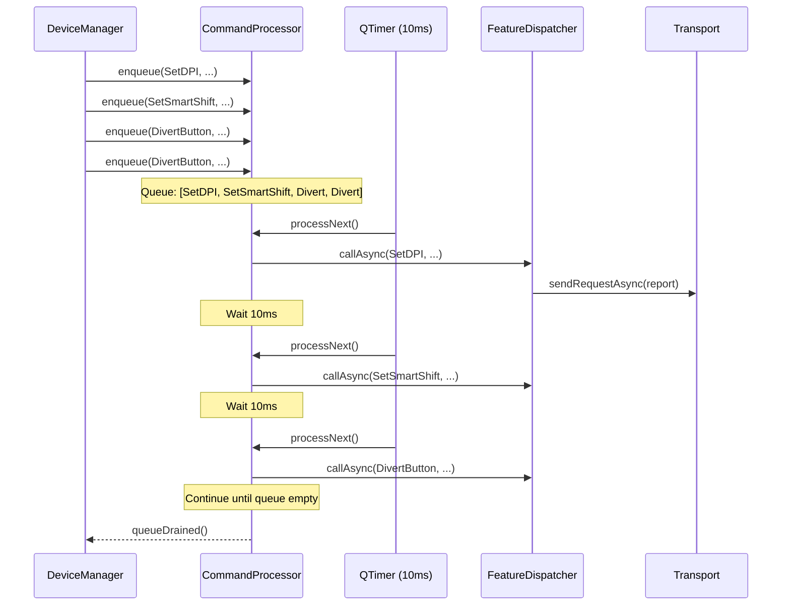

Key properties:

- **10ms inter-command delay** (`kInterCommandDelayMs = 10`) — enough for the device to process each command
- **3 retries** (`kMaxRetries = 3`) with 50ms retry delay
- **Main thread only** — uses `QTimer`, no mutex needed, no fd contention with `QSocketNotifier`
- **Created after feature enumeration** — the command processor is instantiated inside `enumerateAndSetup()` after the feature table is populated

### Async Response Matching

`FeatureDispatcher::callAsync()` uses a rotating `softwareId` (1-15) to match responses to requests:


The `softwareId` field (lower 4 bits of byte[3] in HID++ reports) distinguishes responses from notifications:

- **softwareId = 0** — unsolicited notification from the device (battery change, button press, wheel rotation)
- **softwareId 1-15** — response to a specific request sent by the host

This was a critical fix: without it, async responses from thumb wheel SetReporting were being misinterpreted as thumb wheel rotation events (the "delta=256 bug").

## Profile System

### Profile Struct

```cpp
struct Profile {
    int version = 1;
    QString name;
    QString icon;
    int dpi = 1000;
    bool smartShiftEnabled = true;
    int smartShiftThreshold = 128;
    bool smoothScrolling = false;
    QString scrollDirection = "standard";  // "standard" or "natural"
    bool hiResScroll = true;
    std::array<ButtonAction, 16> buttons;  // indexed by ControlDescriptor::buttonIndex
    std::map<QString, ButtonAction> gestures;  // "up","down","left","right","click"
    QString thumbWheelMode = "scroll";  // "scroll", "zoom", "volume", "none"
    bool thumbWheelInvert = false;
};
```

### ProfileEngine

`ProfileEngine` is the profile domain layer. It owns every `Profile` known to the app, persists them to disk, and answers two questions: "which profile should the UI show for this device?" and "which profile is currently applied to this device's hardware?" Services read and write through its API; no other class touches profile files directly.


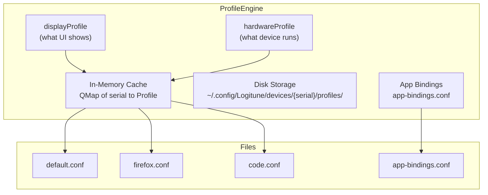

**What each block does:**

- **In-memory cache** — a `QMap<QString, QMap<QString, Profile>>` keyed by `(deviceSerial, profileName)`. `cachedProfile(serial, name)` is the mutable accessor everything else uses; it loads from disk on first access and returns by reference so in-place edits are picked up on the next `saveProfileToDisk(serial, name)`.
- **Disk storage** — each device gets its own directory under `~/.config/Logitune/devices/{serial}/profiles/`. Profiles are named `{profileName}.conf` (one file per profile). The `default.conf` is always present; app-specific profiles are created on demand.
- **App bindings** — `app-bindings.conf` maps window manager class (e.g. `google-chrome`) to a profile name. `profileForApp(serial, wmClass)` consults this map; anything unmapped falls back to `default`. Mutations go through `createProfileForApp(serial, wmClass, profileName)` and `removeAppProfile(serial, wmClass)`.
- **displayProfile** — per-device name of the profile the UI is currently viewing/editing. Updated when the user clicks a profile tab. Emits `deviceDisplayProfileChanged(serial, profile)`.
- **hardwareProfile** — per-device name of the profile currently applied to the hardware. Updated when the focused window changes and `ProfileOrchestrator` pushes a new profile. Emits `deviceHardwareProfileChanged(serial, profile)`.

Display and hardware pointers are independent on purpose. See [Display vs Hardware Profile](#key-design-decision-display-vs-hardware-profile).

### Profile Lifecycle

1. **Device connects** — `onDeviceSetupComplete()` creates the profile directory under `~/.config/Logitune/devices/<serial>/profiles/`
2. **First connect** — seeds `default.conf` from current device hardware state (DPI, SmartShift, scroll config, button defaults from descriptor, default gestures)
3. **Profile load** — `setDeviceConfigDir()` scans the directory for `.conf` files and loads them into the in-memory cache
4. **Focus change** — `profileForApp(wmClass)` looks up the app binding; if none found, returns "default"
5. **Hardware apply** — `applyProfileToHardware()` sends all profile settings via CommandProcessor
6. **User edit** — UI changes go through DeviceModel -> DeviceCommandHandler -> ProfileOrchestrator -> ProfileEngine cache -> disk save
7. **Cache vs disk** — the cache is the source of truth during runtime; saves to disk are immediate but loads only happen at startup

### ProfileDelta

The `ProfileDelta` struct tracks which fields changed between two profiles:

```cpp
struct ProfileDelta {
    bool dpiChanged = false;
    bool smartShiftChanged = false;
    bool scrollChanged = false;
    bool buttonsChanged = false;
    bool gesturesChanged = false;
};
```

This enables future optimizations where only changed settings are sent to hardware during profile switches.

## MVVM Pattern

Logitune uses a Model-View-ViewModel pattern where C++ models serve as the ViewModel layer between QML views and core logic.

The four services split into **translators** and **a coordinator**.

**Translators** do one focused conversion each and do not own multi-step flows:
- `ActiveDeviceResolver` — converts ViewModel state (selected index + device list) into a resolved active device pointer
- `DeviceCommandHandler` — converts ViewModel intent (UI slider drag, toggle click) into Model operations (`DeviceSession::setDPI`, etc.)
- `ButtonActionDispatcher` — converts hardware events (button press, thumb wheel rotation) into domain actions (keystroke injection, app launch)

**Coordinator** — `ProfileOrchestrator` owns a multi-step workflow that reads and writes across both layers. `onWindowFocusChanged` alone does: ViewModel write (active wmClass), Model read (profile-for-app lookup), Model write (set hardware profile), Model command fan-out (apply DPI / SmartShift / scroll / buttons to session), cross-service signal emission (`profileApplied` to dispatcher), ViewModel write (hardware-active profile name). Seven steps spanning both layers per user window-focus change. That is coordination, not translation — which is why it warrants the MVVM-C "Coordinator" role rather than fitting into the same VM-to-Model bridge category as the translators.

Telling signals that something is a coordinator, not a translator:
- Holds pointers to many dependencies (8 on `ProfileOrchestrator`; 1-3 on each translator)
- Owns workflow entry points (`onWindowFocusChanged`, `onUserButtonChanged`, `onTabSwitched`) rather than single-responsibility translators
- Writes to both ViewModels and Model in the same method

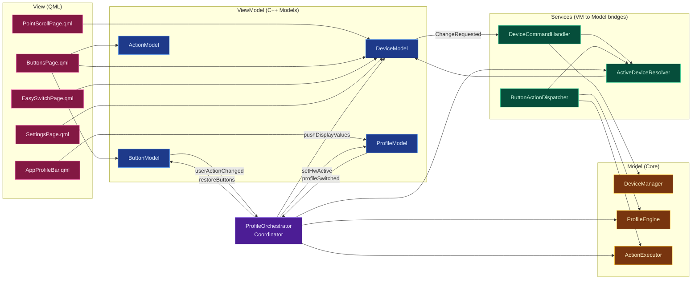

### Model Roles

**DeviceModel** — QObject singleton exposed to QML. Provides:

- Device state (connected, name, battery, connection type)
- Settings (DPI, SmartShift, scroll, thumb wheel)
- Device descriptor info (images, hotspots, Easy-Switch slots)
- Display values that may differ from hardware (when viewing non-active profile)
- Logging control (enable/disable, bug report)

**ButtonModel** — `QAbstractListModel` with roles:

| Role | Type | Description |
|------|------|-------------|
| `ButtonIdRole` | int | Button index (0-7) |
| `ButtonNameRole` | QString | Display name from device descriptor |
| `ActionNameRole` | QString | Current action display name |
| `ActionTypeRole` | QString | Action type: "default", "keystroke", "gesture-trigger", etc. |

**ActionModel** — `QAbstractListModel` catalog of available actions:

| Role | Type | Description |
|------|------|-------------|
| `NameRole` | QString | Display name (e.g., "Copy") |
| `DescriptionRole` | QString | Help text |
| `ActionTypeRole` | QString | "default", "keystroke", "app-launch", etc. |
| `PayloadRole` | QString | Keystroke combo or app command |

**ProfileModel** — `QAbstractListModel` for the profile tab bar:

| Role | Type | Description |
|------|------|-------------|
| `NameRole` | QString | Profile display name |
| `IconRole` | QString | Application icon name |
| `WmClassRole` | QString | Window manager class for app binding |
| `IsActiveRole` | bool | User's selected tab |
| `IsHwActiveRole` | bool | Currently active on hardware |

### Model Registration

Models are registered as QML singletons in `main.cpp`:

```cpp
qmlRegisterSingletonInstance("Logitune", 1, 0, "DeviceModel",        controller.deviceModel());
qmlRegisterSingletonInstance("Logitune", 1, 0, "ButtonModel",        controller.buttonModel());
qmlRegisterSingletonInstance("Logitune", 1, 0, "ActionFilterModel",  controller.actionFilterModel());
qmlRegisterSingletonInstance("Logitune", 1, 0, "ProfileModel",       controller.profileModel());
qmlRegisterSingletonInstance("Logitune", 1, 0, "SettingsModel",      controller.settingsModel());
```

`ActionFilterModel` wraps the raw `ActionModel` catalog and hides entries the selected device can't execute (PR #82). QML code always binds to the filter model, never to the raw catalog. `SettingsModel` exposes the persisted user prefs (dark mode, logging, autostart, minimized, bug reports) as a single Q_PROPERTY surface.

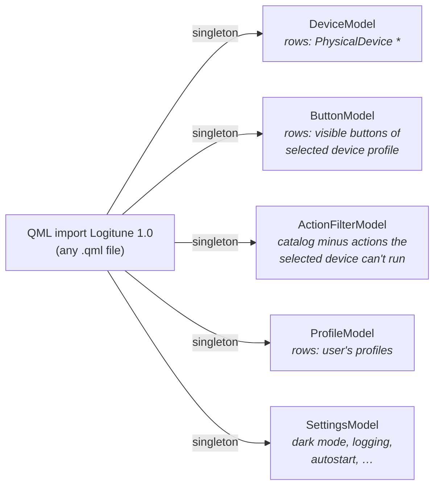

All five are registered in `src/app/main.cpp` against `controller.xxxModel()` accessors — AppRoot owns them, QML borrows them. No other QML-visible C++ classes.

### EditorModel

`EditorModel` (`src/app/models/EditorModel.{h,cpp}`) is the controller for descriptor-editor mode, despite the "Model" name. It is only instantiated when the app is launched with `--edit`; in normal runs the pointer is null and none of its signals fire. Exposed to QML, it stores pending JSON edits per descriptor path, runs an undo / redo stack, and persists through `DescriptorWriter` when the user clicks Save.

**Responsibilities:**

- **Pending-edit buffering.** Edits do not go straight to disk. `m_pendingEdits` (`QHash<QString, QJsonObject>`) holds one in-memory `descriptor.json` per device path; `ensurePending(path)` lazy-loads it from disk on first access. `pushStateToActiveDevice()` applies the pending JSON to the live `JsonDevice` via `JsonDevice::refreshFromObject` so QML bindings see the change immediately even before the user saves.
- **Per-path undo stack.** `m_undoStacks` and `m_redoStacks` are keyed on device path, so switching `activeDevicePath` preserves each device's history independently. Every mutator creates an `EditCommand` with `before` / `after` JSON payloads and calls `pushCommand` to push onto the undo stack (clearing the redo stack).
- **External-change detection.** A `QFileSystemWatcher` (`m_watcher`) watches each loaded `descriptor.json`. On `fileChanged`, `onExternalFileChanged` either suppresses the event (if `m_selfWrittenPaths` shows we just wrote it ourselves), emits `externalChangeDetected(path)` when the user has unsaved edits, or asks `DeviceRegistry::reload` to pick up the new on-disk state otherwise.
- **Atomic save.** `save()` marks the path in `m_selfWrittenPaths` (to suppress the filesystem-watcher echo), calls `m_writer.write(path, pendingJson)`, then clears pending state and asks `DeviceRegistry` to reload on success or emits `saveFailed(path, error)` on failure.

**Q_INVOKABLE API (used from QML):** `updateSlotPosition(idx, xPct, yPct)`, `updateHotspot(idx, xPct, yPct, side, labelOffsetYPct)`, `updateScrollHotspot(idx, xPct, yPct, side, labelOffsetYPct)`, `updateText(field, index, value)`, `replaceImage(role, sourcePath)`, `undo()`, `redo()`, `save()`, `reset()`, plus the `pendingFor(path) -> QVariantMap` accessor for reading the in-memory state.

**Signals:** `dirtyChanged()`, `undoStateChanged()`, `activeDevicePathChanged()`, `saved(path)`, `saveFailed(path, error)`, `externalChangeDetected(path)`. Q_PROPERTY surface: `editing`, `hasUnsavedChanges`, `canUndo`, `canRedo`, `activeDevicePath`.

## Desktop Integration

### Interface Hierarchy

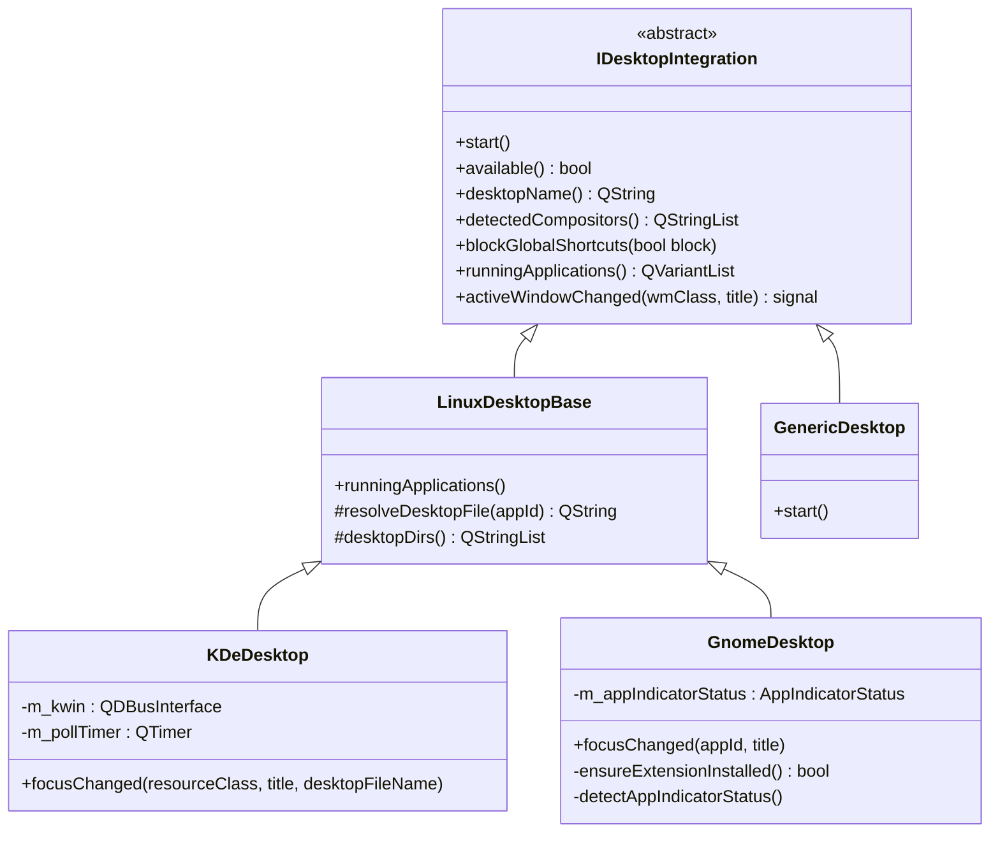

`GnomeDesktop` (Wayland-only) auto-installs and enables a GNOME Shell extension on first launch that pipes focus events to a D-Bus-registered callback in-process — event-driven, no polling. It also detects AppIndicator support via `org.kde.StatusNotifierWatcher` so the tray icon can tell users when to install `gnome-shell-extension-appindicator`. `KDeDesktop` uses a KWin script + polling fallback (the KWin 6 signal quirk).

### KDE Focus Tracking

KDeDesktop uses a KWin script to track window focus changes:

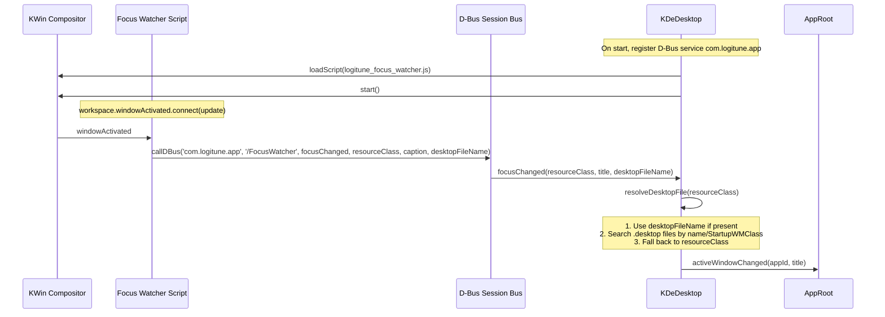

### Window Identity Resolution

A critical problem: the same application can have different identifiers depending on how it's packaged:

- Zoom: `resourceClass="zoom"`, but `.desktop` file is `us.zoom.Zoom.desktop`
- Firefox: `desktopFileName="org.mozilla.firefox"`
- Native KDE apps: `desktopFileName="org.kde.dolphin"`

`resolveDesktopFile()` searches these directories:

1. `/usr/share/applications`
2. `~/.local/share/applications`
3. `/var/lib/flatpak/exports/share/applications` (Flatpak apps installed on the host)
4. `~/.local/share/flatpak/exports/share/applications`
5. `/var/lib/snapd/desktop/applications`

It matches by:
1. Last component of the `.desktop` filename (e.g., "Zoom" from "us.zoom.Zoom")
2. `StartupWMClass` field in the `.desktop` file

Results are cached in `m_resolveCache` to avoid repeated filesystem scans.

### blockGlobalShortcuts

During keystroke capture (when the user is pressing a key combo to assign to a button), KDE global shortcuts are temporarily disabled via:

```cpp
QDBusMessage msg = QDBusMessage::createMethodCall(
    "org.kde.kglobalaccel", "/kglobalaccel",
    "org.kde.KGlobalAccel", "blockGlobalShortcuts");
msg << block;
QDBusConnection::sessionBus().call(msg, QDBus::NoBlock);
```

This prevents Ctrl+Super+Left (assigned to "switch desktop left") from actually switching desktops while the user is trying to capture it as a button binding.

### GNOME Focus Tracking

`GnomeDesktop` (`src/core/desktop/GnomeDesktop.{h,cpp}`) is the Wayland-only GNOME implementation. On `start()` it checks `XDG_SESSION_TYPE == wayland` and pings `org.gnome.Shell` via D-Bus to confirm GNOME Shell is reachable (both gates return `available() = false` if they fail). `ensureExtensionInstalled()` copies the bundled `logitune-focus@logitune.com` Shell extension into `~/.local/share/gnome-shell/extensions/` and enables it via `gnome-extensions enable`; the extension then calls back into the app via D-Bus rather than the app polling for focus.

After the extension is in place, `GnomeDesktop` registers the service `com.logitune.app` and the object `/FocusWatcher` on the session bus (`QDBusConnection::ExportAllSlots`) so the extension's `focusChanged(appId, title)` calls land on the matching slot.

`detectAppIndicatorStatus()` is a separate probe for system-tray support. It checks whether `org.kde.StatusNotifierWatcher` is registered on the session bus (the D-Bus interface that any AppIndicator-compatible extension registers). The result populates `m_appIndicatorStatus` (one of `AppIndicatorUnknown`, `AppIndicatorNotInstalled`, `AppIndicatorDisabled`, `AppIndicatorActive`) so the UI can tell GNOME users to install `gnome-shell-extension-appindicator` when the tray icon will not render.

### Generic Desktop Fallback

`GenericDesktop` (`src/core/desktop/GenericDesktop.{h,cpp}`) is the no-op fallback for desktop environments that are neither KDE nor GNOME (XFCE, MATE, Cinnamon, sway, Hyprland, etc.). `start()` does nothing, `available()` returns true unconditionally, `desktopName()` returns `"Generic"`, `detectedCompositors()` returns an empty list, and `blockGlobalShortcuts(bool)` is a no-op. The practical consequence: per-app profile switching is disabled on these environments because there is no focus-tracking signal; the user can still switch profiles manually through the profile tab bar, and every other feature (HID++, button remapping, uinput injection) continues to work.

### Input Injection

`IInputInjector` (`src/core/interfaces/IInputInjector.h`) is the abstract interface through which the app delivers synthesized input: `init()`, `injectKeystroke(combo)`, `injectCtrlScroll(direction)`, `injectHorizontalScroll(direction)`, `sendDBusCall(spec)`, `launchApp(command)`. `ActionExecutor` holds a non-owning pointer to one; tests substitute `MockInjector` to capture the calls for assertions.

`UinputInjector` (`src/core/input/UinputInjector.{h,cpp}`) is the production `/dev/uinput` implementation. `init()` opens `/dev/uinput` with `O_WRONLY | O_NONBLOCK`, registers the key and relative-axis bits the app can emit (modifiers, arrows, media keys, F1 to F12, A to Z, 0 to 9, plus `REL_WHEEL` and `REL_HWHEEL`), sets up a `uinput_setup` with vendor `0x046d` and product `0x0001` under the name `logitune-virtual-kbd`, and finalizes with `UI_DEV_CREATE`. If any step fails (most often because `/dev/uinput` is not accessible under the user's group or the `logitune` udev rules are missing), `init()` returns false and all subsequent `injectKeystroke` calls are silent no-ops.

Keystroke chord parsing lives in `UinputInjector::parseKeystroke(combo)` (static, unit-tested directly). It splits on `+`, maps modifier tokens (`Ctrl`, `Shift`, `Alt`, `Super` / `Meta`), special keys (`Tab`, `Space`, `Enter`, `Up`, `Down`, `Home`, `PageUp`, `VolumeUp`, `Print`, `BrightnessDown`, etc.), symbols (`Minus`, `Equal`, `LeftBrace`, `Semicolon`, `Comma`), and letters / digits to `KEY_*` codes from `<linux/input-event-codes.h>`. The bare `"+"` chord is handled before the split to preserve the `KEY_KPPLUS` case. `ActionExecutor::parseKeystroke` forwards to this function so tests can cover the parser without constructing an injector.

Key emission in `injectKeystroke` presses all resolved keycodes in order (`emitKey(k, true)` + `emitSync()`), then releases them in reverse order. `injectCtrlScroll(direction)` wraps a `REL_WHEEL` write in a `KEY_LEFTCTRL` press / release so applications that bind zoom to Ctrl+scroll respond. `injectHorizontalScroll(direction)` writes a `REL_HWHEEL` event for the thumb-wheel scroll mode. `launchApp(command)` uses `QProcess::startDetached`; `sendDBusCall(spec)` parses a four-part `service,path,interface,method` string and dispatches through `QDBusConnection::sessionBus().send`.

## Device Discovery and Connection

### DeviceManager

`DeviceManager` is the hardware-facing entry point of the core library. Its job is to detect Logitech HID++ devices on the system, open transports to them, group transports that belong to the same physical unit, and notify the rest of the app when a device appears or disappears.


**Responsibilities:**

- **Hidraw enumeration.** On `start()`, scans `/sys/class/hidraw/` for nodes matching Logitech vendor IDs (direct + Bolt/Unifying receiver variants). For each candidate, probes whether the device speaks HID++ (report descriptor check) and which feature set it advertises.
- **Transport creation.** For each probed device, creates a `DeviceSession` wrapping the hidraw file descriptor and a `CommandProcessor` with its own pacing state.
- **Physical device grouping.** Calls `DeviceInfo.getSerial` over HID++ to get the unit serial, then groups `DeviceSession` instances with the same serial under a single `PhysicalDevice`. A mouse that shows up twice (once via Bolt receiver, once via Bluetooth) becomes one `PhysicalDevice` with two transports. Details in the [transport aggregation section](#physicaldevice-transport-aggregation).
- **udev event handling.** Subscribes to libudev on the session bus for `add` / `remove` events on hidraw nodes. On `add`, probes the new node and either creates a new `PhysicalDevice` or attaches the transport to an existing one. On `remove`, detaches the transport; if the last transport for a `PhysicalDevice` is gone, removes the device.
- **Unknown device reporting.** If a device with a known Logitech VID but an unrecognized PID appears, emits `unknownDeviceDetected(pid)`. `DeviceFetcher` subscribes and tries to pull a community descriptor for that PID from the GitHub-hosted device database.
- **Simulation mode.** `simulateAllFromRegistry()` bypasses udev and HID++ entirely, synthesizing one fake `DeviceSession` + `PhysicalDevice` per descriptor in `DeviceRegistry`. Used by the `--simulate-all` CLI flag to let developers visually inspect every community descriptor without physical hardware. Never called in production.

**Signals emitted:**

- `physicalDeviceAdded(PhysicalDevice*)` — fires when a new unit serial is seen. `AppRoot` subscribes and wires the new device's per-device runtime signals (`gestureRawXY`, `divertedButtonPressed`, `thumbWheelRotation`, `transportSetupComplete`) directly into `ButtonActionDispatcher` and `ProfileOrchestrator`.
- `physicalDeviceRemoved(PhysicalDevice*)` — fires only when the last transport of a device is gone, not on every transport switch. `DeviceModel` drops its row, `ButtonActionDispatcher` drops its gesture state entry for that serial, `ProfileOrchestrator` cleans up any per-device cached state.
- `unknownDeviceDetected(uint16_t pid)` — wired to `DeviceFetcher::fetchForPid` for on-demand descriptor fetching.

**What it does NOT do:**

- Does not own device settings (DPI, SmartShift, etc.). That is `ProfileEngine`.
- Does not parse HID++ responses. That is `FeatureDispatcher` + `DeviceSession`.
- Does not write profiles to hardware. That is `ProfileOrchestrator` via `DeviceSession` setters.

### PhysicalDevice: transport aggregation

A single MX Master 3S mouse typically appears on the host as *two* hidraw nodes when both transports are active — once via the Bolt/Unifying receiver, once via direct Bluetooth. HID++ unit serial (from `DeviceInfo.getSerial`) identifies them as the same physical unit. `src/core/PhysicalDevice.{h,cpp}` is the abstraction that collapses them:


- Owned by `DeviceManager`, keyed by serial.
- Holds a non-owning list of `DeviceSession *` transports.
- Exposes a single `primary()` pointer — commands route there.
- Picks primary based on connection state: if the current primary goes stale (udev remove, ping timeout), switches to any other connected transport without the UI seeing a disconnect event.
- Emits `stateChanged` / `deviceNameChanged` / `batteryChanged` once per underlying transition, not per transport — models bind to `PhysicalDevice`, not the raw `DeviceSession`.

The UI, `DeviceModel`, `ProfileEngine`, and tray all deal in `PhysicalDevice *`. `DeviceSession *` is an implementation detail of the transport layer.

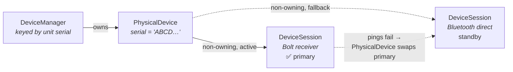

When the active transport drops (udev remove, HID++ ping timeout), `PhysicalDevice::setPrimary()` picks any remaining connected session. The UI never sees a disconnect event — `stateChanged` still fires, but `DeviceModel`'s row for this serial stays.

### DeviceSession

`DeviceSession` (`src/core/DeviceSession.{h,cpp}`) is the per-transport object: one hidraw fd, one HID++ conversation, one set of per-device runtime state. A `PhysicalDevice` owns one or more of these; everything that writes to hardware eventually calls setter methods here.


**Responsibilities:**

- **Owns the protocol stack for one transport.** Holds `unique_ptr<HidrawDevice>`, `unique_ptr<Transport>`, `unique_ptr<FeatureDispatcher>`, and `unique_ptr<CommandProcessor>` as members (`DeviceSession.h` lines 135 to 138). `enumerateAndSetup()` is the single entry point that probes features, reads initial state (battery, DPI, SmartShift, scroll config, thumb wheel, Easy-Switch hosts), and constructs the `CommandProcessor` only once the feature table is ready.
- **Resolves capability variants at enumeration.** Stores `optional<BatteryVariant>`, `optional<SmartShiftVariant>`, `optional<ReprogControlsVariant>` (`DeviceSession.h` lines 140 to 142) populated via `capabilities::resolveCapability`. All later reads and writes go through the resolved variant, so `DeviceSession` has no per-generation branching of its own.
- **Hardware setter API.** `setDPI(int)`, `setSmartShift(bool, int)`, `setScrollConfig(bool, bool)`, `setThumbWheelMode(QString, bool)`, `divertButton(uint16_t, bool, bool rawXY)`, and the Q_INVOKABLE `cycleDpi()`. Each enqueues one command on the `CommandProcessor` with a 10 ms pacing gap rather than writing directly.
- **Read-only getters.** `currentDPI`, `minDPI`, `maxDPI`, `dpiStep`, `smartShiftEnabled`, `smartShiftThreshold`, `scrollHiRes`, `scrollInvert`, `scrollRatchet`, `thumbWheelMode`, `thumbWheelInvert`, `thumbWheelDefaultDirection`, `batteryLevel`, `batteryCharging`, `currentHost`, `hostCount`, `isHostPaired(int)`. These are projections of `m_*` members, updated by notification handlers and by responses to our requests.
- **Notification dispatch.** `handleNotification(const Report&)` is called by `DeviceManager` from the hidraw `QSocketNotifier` for reports with `softwareId == 0`. Routes thumb wheel, gesture, button, battery, and link-state notifications to the right per-feature handler.
- **Sleep / wake detection.** `checkSleepWake()` runs on the battery poll timer and compares `m_lastResponseTime` against `kSleepThresholdMs`. `touchResponseTime()` is called before intentional hardware writes so a profile switch does not look like a wake event. See [Sleep/Wake Detection](#sleepwake-detection).
- **Connection tracking.** `m_connected`, `m_deviceName`, `m_deviceSerial`, `m_firmwareVersion`, and `m_activeDevice` (non-owning `const IDevice*` pointer to the descriptor matched via `DeviceRegistry`) make up the session's identity. `disconnectCleanup()` tears down logical state without closing the fd (see [Bolt Receiver DJ Notifications](#bolt-receiver-dj-notifications)).
- **Simulation hook.** `applySimulation(const IDevice*, QString fakeSerial)` is the `--simulate-all` entry point; it fakes a connected state against a registry descriptor so the UI can render without real hardware. Never called in production.

**Signals emitted:**

- `setupComplete()`: emitted once `enumerateAndSetup` finishes, triggering `ProfileOrchestrator::onTransportSetupComplete` via `PhysicalDevice::transportSetupComplete`.
- `disconnected()`, `deviceWoke()`: transport-state transitions.
- `batteryChanged(level, charging)`, `smartShiftChanged(enabled, threshold)`, `currentDPIChanged()`, `scrollConfigChanged()`, `thumbWheelModeChanged()`: property-change signals mirrored up to `PhysicalDevice`.
- `divertedButtonPressed(controlId, pressed)`, `gestureRawXY(dx, dy)`, `thumbWheelRotation(delta)`: raw input events consumed by `ButtonActionDispatcher`.
- `unknownDeviceDetected(pid)`: forwarded up to `DeviceManager` so `DeviceFetcher` can pull a community descriptor.

**Helpers:**

- `flushCommandProcessor()` drains the pending command queue (used during profile switches and teardown).
- The static `effectiveDpiRing(curated, adjustableDpi, min, max, step)` and `nextDpiInRing(ring, currentDpi)` are pure helpers unit-tested independently in `tests/test_dpi_cycle_ring.cpp`.

### Discovery Flow

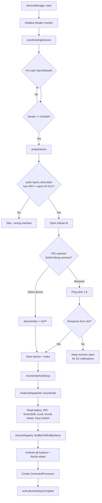

### Report Descriptor Check

Before opening a hidraw device, Logitune checks the sysfs report descriptor for the HID++ long report ID (`0x11`). This is critical because:

- Each HID device exposes multiple hidraw interfaces (keyboard, mouse, vendor-specific)
- Opening and writing to the wrong interface can "poison" sibling interfaces
- The sysfs check at `/sys/class/hidraw/hidrawN/device/report_descriptor` avoids this without opening the fd

### Bolt Receiver Slot Probing

For receiver connections, Logitune pings device indices 1-6 with a HID++ 2.0 Root feature request. The receiver may respond with:

- HID++ 2.0 long report (success)
- HID++ 1.0 short report (legacy device)
- HID++ 1.0 error with code 0x09 (no device on slot)
- HID++ 2.0 error (device not present)

If no device is found on any slot, the receiver fd is kept open and a `QSocketNotifier` watches for incoming traffic, indicating a device has connected.

## Device Registry

`DeviceRegistry` loads device descriptors at startup from three sources
(scanned in order; earlier entries win on PID collisions via
`findByPid` returning the first match):

1. `$XDG_DATA_DIRS/logitune/devices/<slug>/descriptor.json` (system,
   where `cmake --install` places the `devices/` folder from the repo)
2. `$XDG_CACHE_HOME/logitune/devices/<slug>/descriptor.json` (cache,
   rarely used directly)
3. `$XDG_DATA_HOME/logitune/devices/<slug>/descriptor.json` (user
   override, for iterating on a community descriptor without
   rebuilding; remove the matching system descriptor first if you
   need the user version to take precedence)

Each descriptor is wrapped in a `JsonDevice` instance that exposes the
`IDevice` interface consumed by the rest of the app. `JsonDevice` is
the only concrete `IDevice` subclass; there are no per-device C++
classes. A new device is a `descriptor.json` file plus three images.

### Key Components

- **`JsonDevice`** (`src/core/devices/JsonDevice.{h,cpp}`): parses `descriptor.json` and adapts to the `IDevice` interface. Tracks the source directory path and modification time for live reload support.
- **`DescriptorWriter`** (`src/core/devices/DescriptorWriter.{h,cpp}`): atomic writes to `descriptor.json`, preserving unknown fields so hand-edited entries survive a round-trip through the editor.
- **`EditorModel`** (`src/app/models/EditorModel.{h,cpp}`): `--edit` mode state machine, undo/redo command stack, and file-conflict detection. Drives the in-app descriptor editor.

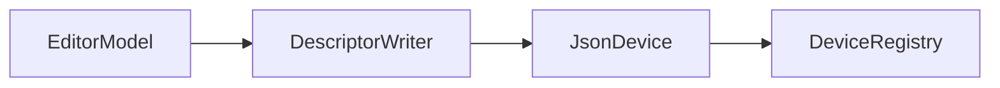

For the contributor-facing workflow, see
[Adding a Device](Adding-a-Device). For the visual-editing tool, see
[Editor Mode](Editor-Mode).

## Device Descriptors

A device in Logitune is data, not code. Every supported mouse is a directory under `devices/{slug}/` containing one `descriptor.json` plus `front.png`, `side.png`, and `back.png`. At startup `DeviceRegistry` enumerates these directories, wraps each one in a `JsonDevice`, and that `JsonDevice *` is what the rest of the app sees through the `IDevice` interface. Adding a new mouse requires no C++ changes.

### IDevice

`IDevice` (`src/core/interfaces/IDevice.h`) is the pure-virtual interface every descriptor satisfies. It is intentionally read-only: getters for identity (`deviceName`, `productIds`, `matchesPid(pid)`), DPI range (`minDpi`, `maxDpi`, `dpiStep`, `dpiCycleRing`), buttons (`controls()` returning `QList<ControlDescriptor>`), hotspots (`buttonHotspots()`, `scrollHotspots()`), feature support flags (`features()` returning `FeatureSupport`), images (`frontImagePath`, `sideImagePath`, `backImagePath`), default gestures (`defaultGestures()` keyed by `"up" / "down" / "left" / "right" / "click"`), and Easy-Switch slot positions (`easySwitchSlotPositions()`).

Three structs carry the runtime values:

- `ControlDescriptor`: HID++ `controlId` (e.g. `0x00C3` for the gesture button), zero-based `buttonIndex`, default name, `defaultActionType` (`"default"`, `"gesture-trigger"`, `"smartshift-toggle"`), and a `configurable` flag that tells the UI whether the user can remap this button.
- `HotspotDescriptor`: per-button annotation coordinates for the QML overlay. `xPct` / `yPct` are 0 to 1 floats, `side` is `"front" / "side" / "back"`, `kind` distinguishes scroll / thumb-wheel hotspots from button hotspots.
- `FeatureSupport`: 27 booleans gating UI visibility. When `smartShift` is `false`, the SmartShift slider is hidden; when `thumbWheel` is `false`, the Point & Scroll page hides thumb-wheel controls; and so on. See the MX Master 3S descriptor at `devices/mx-master-3s/descriptor.json` for the shape.

`IDevice` is consumed throughout the runtime: `DeviceSession` holds a `const IDevice*` as `m_activeDevice`, `ProfileEngine` seeds `default.conf` from it, `ButtonModel` iterates `controls()` to render the buttons list, `ButtonActionDispatcher` reads `defaultGestures()` for gesture routing, and the QML overlays read hotspots from `DeviceModel`.

### JsonDevice

`JsonDevice` (`src/core/devices/JsonDevice.{h,cpp}`) is the only concrete `IDevice` implementation shipped with Logitune. `JsonDevice::load(dirPath)` opens `descriptor.json` in the given directory, parses it into the member structures (`m_pids`, `m_features`, `m_minDpi`, `m_controls`, `m_buttonHotspots`, `m_scrollHotspots`, `m_frontImage`, `m_sideImage`, `m_backImage`, `m_defaultGestures`, `m_easySwitchSlots`, `m_dpiCycleRing`), and stores `m_sourcePath` + `m_loadedMtime` so `DeviceRegistry::reload(path)` can do targeted live reloads when the descriptor changes on disk. `refreshFromObject(QJsonObject)` lets `EditorModel` push pending in-memory edits into the live device without going through disk.

`status()` distinguishes `Verified` from `Beta` devices; the UI uses this to show a "beta descriptor" banner on first launch for community-contributed entries. There are no per-device C++ subclasses.

### DescriptorWriter

`DescriptorWriter` (`src/core/devices/DescriptorWriter.{h,cpp}`) is the save path for `EditorModel`. `write(dirPath, QJsonObject, errorOut)` uses `QSaveFile` for an atomic write (temp file + rename) to `descriptor.json` inside the target directory, returning `Ok`, `IoError`, or `JsonError`. Atomicity matters because the editor's `QFileSystemWatcher` would otherwise observe a truncated mid-write state and try to reload a broken descriptor. Not used outside editor mode.

### DeviceFetcher

`DeviceFetcher` (`src/core/DeviceFetcher.{h,cpp}`) brings community-contributed descriptors from GitHub into the user's local devices directory. Two entry points:

- `fetchManifest()` is called at startup (if `isCacheFresh()` returns false; the TTL is `kCacheTtlSeconds = 3600`). It GETs `kManifestUrl` (the `manifest.json` in the `logitune-devices` GitHub repository) and compares each listed slug's `manifestVersion` against what is already cached; anything new or updated is downloaded via `downloadDevice(slug, info)`.
- `fetchForPid(pid)` is wired to `DeviceManager::unknownDeviceDetected(pid)`. When an unrecognized Logitech device appears, `DeviceFetcher` looks up that PID in the cached manifest (`findDeviceForPid`), downloads the matching descriptor + images, and writes them into `deviceCachePath(slug)`.

On successful fetch, `DeviceFetcher` emits `descriptorsUpdated()`, which `DeviceRegistry` subscribes to so it can rescan the local directory and expose the new device without a restart. The HTTP cache is keyed on ETag (`saveEtag` / `loadEtag`) and timestamp (`saveTimestamp` / `isCacheFresh`) to avoid re-downloading unchanged manifests.

## Disconnect and Reconnect

### Bolt Receiver DJ Notifications

When a device disconnects from a Bolt receiver (e.g., turned off, moved out of range), the receiver sends a HID++ 1.0 DeviceConnection notification (register `0x41`):

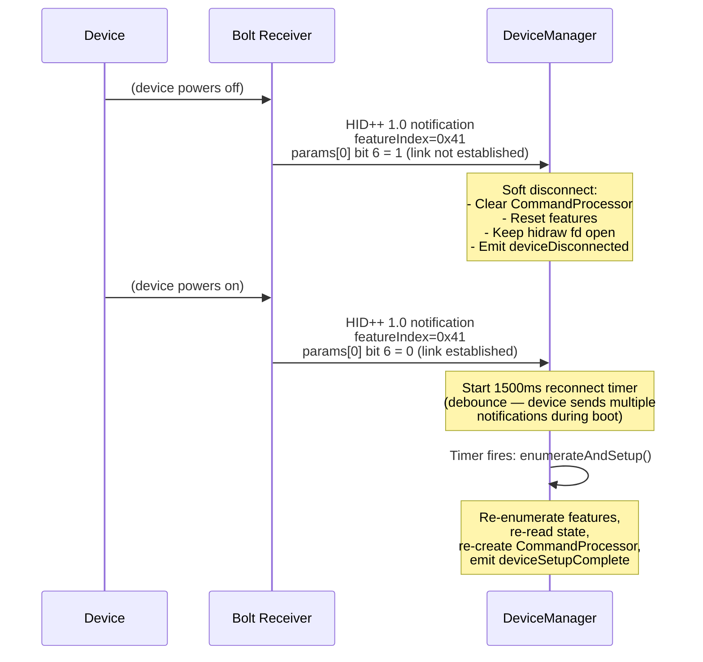

Key details:

- **Soft disconnect** — the hidraw fd stays open. Only logical state (features, command processor, connected flag) is reset.
- **1500ms debounce** — the device sends multiple DJ notifications during boot, and HID++ calls fail with HwError if sent too early.
- **Reconnect timer cancellation** — if multiple link-established notifications arrive, only the last one triggers re-enumeration.

### Transport Failover

When a device is connected via both Bolt and Bluetooth:

1. New hidraw device appears via udev "add" event
2. DeviceManager pings the current device
3. If the current device is unresponsive, switches to the new transport
4. Emits `transportSwitched(newType)`

### Sleep/Wake Detection

`checkSleepWake()` monitors the gap between HID++ responses. If no response has been received for 2 minutes (`kSleepThresholdMs = 120000`), the device is assumed to have been sleeping. On the next response:

1. Wait 500ms for the device to fully wake
2. Re-enumerate features (firmware may have reset state)
3. Emit `deviceWoke()`

The `touchResponseTime()` method is called before intentional hardware writes to prevent false sleep/wake detection during profile switches.

## Gesture System

The gesture system intercepts raw mouse XY deltas when the gesture button is held down:

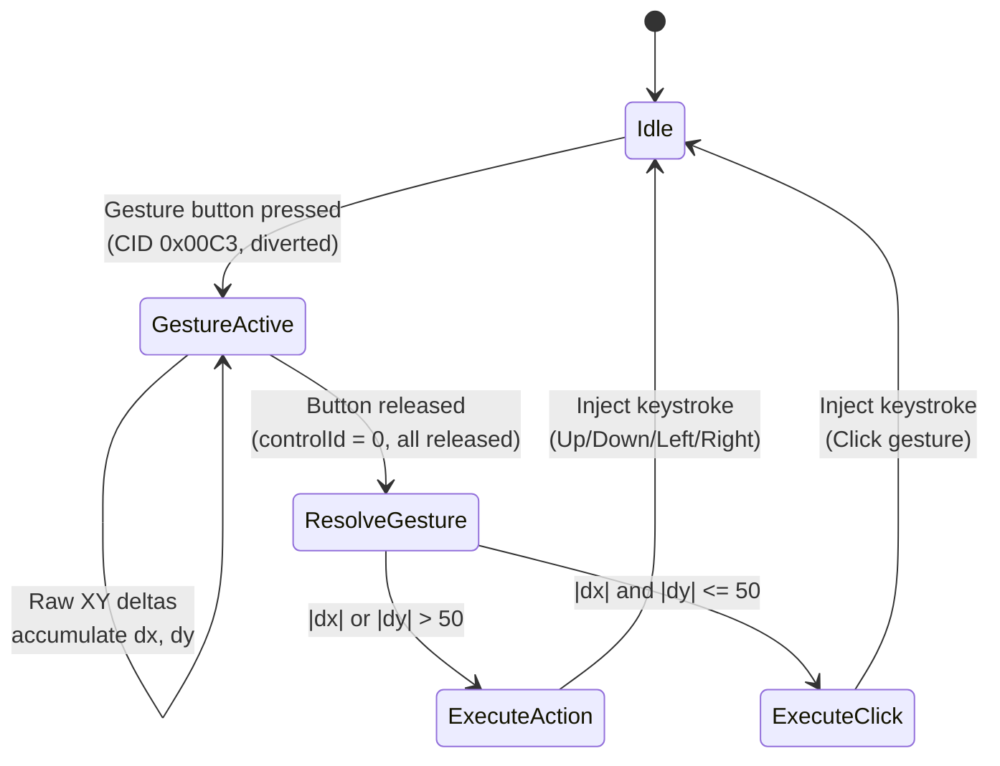

Direction resolution:

- If `|dx| > |dy|`: Left (dx < 0) or Right (dx > 0)
- If `|dy| > |dx|`: Up (dy < 0) or Down (dy > 0)
- If neither exceeds threshold (50 units): Click

The gesture button (CID `0x00C3` on MX Master 3S) is diverted with `rawXY=true`, which causes the device to send `DivertedRawXYEvent` notifications instead of normal mouse movement.

## Thumb Wheel

### Mode Processing

The thumb wheel supports four modes:

| Mode | HID++ | Action |
|------|-------|--------|
| `scroll` | Not diverted | Native horizontal scroll (no software processing) |
| `zoom` | Diverted | Ctrl+scroll injection (Ctrl held + vertical scroll event) |
| `volume` | Diverted | VolumeUp/VolumeDown key injection |
| `none` | Not diverted | No action |

When diverted, the device sends thumb wheel rotation events with raw delta values. These are:

1. **Normalized** by `thumbWheelDefaultDirection` (read from ThumbWheel GetInfo) so clockwise = positive
2. **Accumulated** in `m_thumbAccum`
3. **Thresholded** at `kThumbThreshold = 15` to convert continuous rotation into discrete steps
4. **Executed** as the appropriate action for each step

### Direction Normalization

The MX Master 3S reports `defaultDirection = 0` (positive when left/back), so `thumbWheelDefaultDirection = -1`. Multiplying raw deltas by -1 makes clockwise = positive, which is the natural direction for zoom-in and volume-up.

## ActionExecutor

`ActionExecutor` (`src/core/ActionExecutor.{h,cpp}`) is the bridge between `ButtonActionDispatcher` deciding "this button press should inject Ctrl+C" and an actual uinput / D-Bus / exec call reaching the system. It holds a non-owning `IInputInjector*` and delegates every side-effecting call to it, so swapping `UinputInjector` for `MockInjector` in tests is a one-line constructor change.


**Responsibilities:**

- **Action dispatch.** `executeAction(const ButtonAction&)` switches on `action.type`: `Keystroke` and `Media` both forward to `injectKeystroke(payload)`; `DBus` to `executeDBusCall(payload)`; `AppLaunch` to `launchApp(payload)`. `Default`, `GestureTrigger`, and `SmartShiftToggle` are handled upstream in `ButtonActionDispatcher` and fall through to a no-op here.
- **Injector routing.** `injectKeystroke(combo)`, `injectCtrlScroll(direction)`, `injectHorizontalScroll(direction)`, `executeDBusCall(spec)`, `launchApp(command)` are one-line passthroughs to the injector.
- **Gesture detection.** Owns a `GestureDetector` instance accessible via `gestureDetector()`. `GestureDetector::addDelta(dx, dy)` accumulates the raw XY deltas emitted during a held gesture button; `resolve()` returns the dominant-axis `GestureDirection` (`Up`, `Down`, `Left`, `Right`, or `Click` when neither axis exceeds `kThreshold = 50`). `reset()` is called between gestures.

**Static helpers (testable without an injector):**

- `parseKeystroke(combo)` forwards to `UinputInjector::parseKeystroke` so tests can exercise the parser without opening `/dev/uinput`.
- `parseDBusAction(spec)` splits a `service,path,interface,method` string into a `DBusCall` struct; returns an empty struct when the spec is malformed.
- `gestureDirectionName(dir)` maps the enum to its display string.

**Dependency injection:** `setInjector(IInputInjector*)` lets callers swap the injector post-construction (used by `AppRoot::Dependency Injection` and by test fixtures). `ActionExecutor` stores no state of its own other than the gesture accumulator and the injector pointer.

## Services

Behavior that responds to user events or mutates application state lives in one of four focused services in `src/app/services/`. Each service holds non-owning pointers to the models, engines, or `ActiveDeviceResolver` instance it needs, has zero `connect()` calls of its own, and communicates with its peers only via Qt signals wired by `AppRoot`.

The dependency rule, enforced at the code level:

> Services hold pointers only to models, engines, and `ActiveDeviceResolver`. Cross-service communication is always via signal, wired in `AppRoot`.

### ActiveDeviceResolver

Resolves the currently selected `PhysicalDevice` / `DeviceSession` / serial from `DeviceModel`'s selection index and its ordered device list. This is the single source of truth for "who is selected", so every other service asks here rather than re-deriving it.


- **Constructor dependencies:** `DeviceModel*`
- **Public accessors:** `activeDevice()`, `activeSession()`, `activeSerial()`
- **Public slots:** `onSelectionIndexChanged()`
- **Signals:** `selectionChanged()`
- **State:** none (pure projection over `DeviceModel`)

### DeviceCommandHandler

Routes UI change requests (slider drag, toggle click) to the active `DeviceSession`. Every mutator is a no-op when there is no active session, which makes the service safe to invoke before any device attaches.


- **Constructor dependencies:** `ActiveDeviceResolver*`
- **Public slots:** `requestDpi(int)`, `requestSmartShift(bool, int)`, `requestScrollConfig(bool, bool)`, `requestThumbWheelMode(QString)`, `requestThumbWheelInvert(bool)`
- **Signals:** `userChangedSomething()` emitted after every successful mutation, for `ProfileOrchestrator::saveCurrentProfile` to latch on to
- **State:** none
- **Note:** `applyProfileToHardware` (the burst during a profile switch) does *not* go through `DeviceCommandHandler`. It calls the session directly. `DeviceCommandHandler` is specifically for user-initiated control changes from the UI.

### ButtonActionDispatcher

Interprets raw HID++ input events (`gestureRawXY`, `divertedButtonPressed`, `thumbWheelRotation`) and dispatches high-level actions: keystroke injection, app launch, DPI cycle, SmartShift toggle, gesture direction resolution, and thumb-wheel-mode actions. Owns the per-device gesture + thumb-wheel accumulator state.


- **Constructor dependencies:** `ProfileEngine*`, `ActionExecutor*`, `ActiveDeviceResolver*`
- **Public slots:** `onGestureRaw(int16_t, int16_t)`, `onDivertedButtonPressed(uint16_t, bool)`, `onThumbWheelRotation(int)`, `onProfileApplied(QString)`, `onCurrentDeviceChanged(const IDevice*)`
- **Public methods:** `onDeviceRemoved(QString)` to drop per-device state
- **State:** `QMap<QString, PerDeviceState>` keyed by serial. Each entry holds `gestureAccumX/Y`, `thumbAccum`, `gestureActive`, `gestureControlId`. Gesture threshold is 50, thumb threshold is 15.

### ProfileOrchestrator

Owns the save, apply, push, and window-focus flow. Holds no device state beyond a current `IDevice*` pointer; reads from models and engines, writes to them, and emits `profileApplied(serial)` after every hardware apply so the dispatcher can reset its thumb accumulator.


- **Constructor dependencies:** `ProfileEngine*`, `ActionExecutor*`, `ActiveDeviceResolver*`, `DeviceModel*`, `ButtonModel*`, `ActionModel*`, `ProfileModel*`, `IDesktopIntegration*`
- **Public methods:** `setupProfileForDevice(PhysicalDevice*)`, `applyProfileToHardware(const Profile&)`, `applyDisplayedChange<Mutator, HardwareForward>(...)` (the templated bridge used by `AppRoot` for the five `DeviceModel` `*ChangeRequested` signals)
- **Public slots:** `saveCurrentProfile()`, `onUserButtonChanged(int, QString, QString)`, `onTabSwitched(QString)`, `onDisplayProfileChanged(QString, const Profile&)`, `onWindowFocusChanged(QString, QString)`, `onTransportSetupComplete(PhysicalDevice*)`, `onCurrentDeviceChanged(const IDevice*)`
- **Signals:** `profileApplied(QString serial)`, `currentDeviceChanged(const IDevice*)`
- **State:** `m_currentDevice` (non-owning `const IDevice*`)

## AppRoot Wiring

`AppRoot` is the composition root. It owns the long-lived singletons (ViewModels, services, engines, `DeviceRegistry`, `DeviceManager`, `DeviceFetcher`), wires the signal graph between them at startup, attaches `PhysicalDevice` instances into the graph at runtime, and exposes ViewModels via accessors for QML registration in `main.cpp`. It does not implement user-facing behavior; every `connect()` call in the app library lives either in `wireSignals()` or in `onPhysicalDeviceAdded()`.


The wiring falls into three groups:

- **(a) QML → AppRoot ViewModel → Service.** User events from QML update a ViewModel; `AppRoot` has a `connect()` from the ViewModel's signal into the relevant service slot.
- **(b) Service → Service.** Cross-service communication, always via a signal emitted by one service and a slot on another, with the edge living in `wireSignals()`.
- **(c) Hardware → AppRoot → Service.** Per-device runtime wiring in `onPhysicalDeviceAdded`: each new `PhysicalDevice` gets its input signals (`gestureRawXY`, `divertedButtonPressed`, `thumbWheelRotation`, `transportSetupComplete`) hooked into the appropriate service slots.

### AppRoot signal wiring

**Scope of this table:** the `connect()` calls AppRoot performs. Not every signal in the app.

AppRoot wires the signal graph between services, ViewModels, engines, and interfaces at startup (inside `wireSignals()` and `startMonitoring()`), plus the per-device runtime wiring that fires when a `PhysicalDevice` is attached (inside `onPhysicalDeviceAdded()`). Other subsystems wire their own internal listeners:

- `PhysicalDevice` wires its attached `DeviceSession` transports as they come and go (dynamic fan-in, not startable from AppRoot)
- `TrayManager` wires its own `DeviceModel::countChanged` and `PhysicalDevice::stateChanged` subscriptions inside its constructor (it is a UI shell, not one of the four services subject to the "no `connect()` in services" rule)
- `DeviceModel` wires internal property cascades between its own members
- `DeviceFetcher`, `KDeDesktop`, `GnomeDesktop`, `DeviceSession`, `CommandProcessor`, `EditorModel` wire their own Qt framework plumbing: `QNetworkReply`, D-Bus proxies, `QTimer`, `QFileSystemWatcher`, `QSocketNotifier`. These are implementation details of each class.

The table below covers only AppRoot's wiring. Each row is one `connect()` call. Where one signal lands in a lambda that has two distinct effects (the `*ChangeRequested` fan-outs), each effect gets its own row so both the cache-update path and the hardware-forward path are visible.

**Most signals have only one sink because AppRoot's graph is deliberately linear.** Qt supports one-to-many emission; AppRoot simply rarely needs it. The one AppRoot-level exception is `DeviceModel::selectedChanged`, which has two sinks: `ActiveDeviceResolver` at startup (always) and an `EditorModel` path in `startMonitoring` (editor mode only).

**Groups (ordering the rows below):**

- **🔵 Startup** — `connect()` calls in `wireSignals()` or `startMonitoring()` where the source is a ViewModel, engine, manager, or interface. These are the "ordinary" wires: a user event or domain event in, a service slot out.
- **🟣 Cross-service** — also wired at startup. Source is one of the four services or `ActiveDeviceResolver`; sink is another service or AppRoot itself. These are the signal paths that make the service mesh cooperate (e.g. `ProfileOrchestrator::profileApplied` → `ButtonActionDispatcher::onProfileApplied`).
- **🟠 Per-device** — runtime wiring made in `onPhysicalDeviceAdded()`. These fire every time a new `PhysicalDevice` attaches and tear down on detach. The source is always a `PhysicalDevice` instance.

How to decide the group for a new row:

1. Is the `connect()` inside `onPhysicalDeviceAdded()` or a method it calls? → **🟠 Per-device**.
2. Else: is the source one of the four services or `ActiveDeviceResolver`? → **🟣 Cross-service**.
3. Else (source is a ViewModel / engine / manager / interface, and the wire is made at startup): → **🔵 Startup**.

#### 🔵 Startup

| Source | Signal | Sink |
|--------|--------|------|
| ButtonModel | `userActionChanged` | ProfileOrchestrator::`onUserButtonChanged` |
| IDesktopIntegration | `activeWindowChanged` | ProfileOrchestrator::`onWindowFocusChanged` |
| ProfileModel | `profileSwitched` | ProfileOrchestrator::`onTabSwitched` |
| ProfileEngine | `deviceDisplayProfileChanged` | ProfileOrchestrator::`onDisplayProfileChanged` |
| DeviceModel | `selectedChanged` | ActiveDeviceResolver::`onSelectionIndexChanged` |
| DeviceModel | `selectedChanged` | lambda → EditorModel::`setActiveDevicePath` (editor mode only) |
| DeviceModel | `userGestureChanged` | lambda → ProfileOrchestrator::`saveCurrentProfile` |
| DeviceModel | `dpiChangeRequested` | lambda → ProfileOrchestrator::`applyDisplayedChange` (cache + UI) |
| DeviceModel | `dpiChangeRequested` | lambda → DeviceCommandHandler::`requestDpi` (hardware, guarded) |
| DeviceModel | `smartShiftChangeRequested` | lambda → ProfileOrchestrator::`applyDisplayedChange` (cache + UI) |
| DeviceModel | `smartShiftChangeRequested` | lambda → DeviceCommandHandler::`requestSmartShift` (hardware, guarded) |
| DeviceModel | `scrollConfigChangeRequested` | lambda → ProfileOrchestrator::`applyDisplayedChange` (cache + UI) |
| DeviceModel | `scrollConfigChangeRequested` | lambda → DeviceCommandHandler::`requestScrollConfig` (hardware, guarded) |
| DeviceModel | `thumbWheelModeChangeRequested` | lambda → ProfileOrchestrator::`applyDisplayedChange` (cache + UI) |
| DeviceModel | `thumbWheelModeChangeRequested` | lambda → DeviceCommandHandler::`requestThumbWheelMode` (hardware, guarded) |
| DeviceModel | `thumbWheelInvertChangeRequested` | lambda → ProfileOrchestrator::`applyDisplayedChange` (cache + UI) |
| DeviceModel | `thumbWheelInvertChangeRequested` | lambda → DeviceCommandHandler::`requestThumbWheelInvert` (hardware, guarded) |
| ProfileModel | `profileAdded` | lambda → ProfileEngine::`createProfileForApp` |
| ProfileModel | `profileRemoved` | lambda → ProfileEngine::`removeAppProfile` |
| DeviceManager | `physicalDeviceAdded` | AppRoot::`onPhysicalDeviceAdded` |
| DeviceManager | `physicalDeviceRemoved` | AppRoot::`onPhysicalDeviceRemoved` |
| DeviceManager | `unknownDeviceDetected` | DeviceFetcher::`fetchForPid` |
| DeviceFetcher | `descriptorsUpdated` | lambda → DeviceRegistry::`reloadAll` |

The lambdas in the `DeviceModel::*ChangeRequested` rows all call `applyDisplayedChange(mutator, hardwareForward)`. That helper persists the cached profile, refreshes the UI unconditionally, and only invokes `DeviceCommandHandler` when the displayed profile is also the active hardware profile. The `DeviceManager::unknownDeviceDetected` / `DeviceFetcher::descriptorsUpdated` pair is the device-database integration path: an unknown PID triggers a targeted fetch, and a successful fetch reloads the local descriptor registry so the new device appears on the next enumeration without a restart.

#### 🟣 Cross-service

| Source | Signal | Sink |
|--------|--------|------|
| ActiveDeviceResolver | `selectionChanged` | AppRoot::`onSelectionChanged` |
| DeviceCommandHandler | `userChangedSomething` | ProfileOrchestrator::`saveCurrentProfile` |
| ProfileOrchestrator | `profileApplied` | ButtonActionDispatcher::`onProfileApplied` |
| ProfileOrchestrator | `currentDeviceChanged` | ButtonActionDispatcher::`onCurrentDeviceChanged` |

#### 🟠 Per-device

| Source | Signal | Sink |
|--------|--------|------|
| PhysicalDevice | `gestureRawXY` | ButtonActionDispatcher::`onGestureRaw` |
| PhysicalDevice | `divertedButtonPressed` | ButtonActionDispatcher::`onDivertedButtonPressed` |
| PhysicalDevice | `thumbWheelRotation` | ButtonActionDispatcher::`onThumbWheelRotation` |
| PhysicalDevice | `transportSetupComplete` | lambda → ProfileOrchestrator::`onTransportSetupComplete` |

### Dependency Injection

AppRoot accepts optional `IDesktopIntegration*` and `IInputInjector*` in its constructor:

```cpp
AppRoot(IDesktopIntegration *desktop, IInputInjector *injector, QObject *parent = nullptr);
```

- If `nullptr` is passed (production), it creates `KDeDesktop` and `UinputInjector` internally
- In tests, `MockDesktop` and `MockInjector` are injected for deterministic behavior
- The injected pointers are **not owned** by AppRoot (raw pointers); internally created ones are held in `unique_ptr`

This is the sole DI point: the rest of the subsystems are value members of AppRoot, which simplifies lifetime management.

## TrayManager

`TrayManager` (`src/app/TrayManager.{h,cpp}`) owns the `QSystemTrayIcon` and its context menu. It is constructed with a non-owning `DeviceModel*` so it can reflect per-device state (name, battery) without reaching into `DeviceManager` directly.

**Menu composition.** The menu skeleton is fixed: `Show Logitune` at the top, a separator, then a block of per-device entries inserted before a trailing `Quit`. Each device contributes a `DeviceEntry` struct (`TrayManager.h` lines 32 to 37) with three disabled actions: a header showing `deviceName()`, a battery row showing `"Battery: N%"`, and a trailing separator. `rebuildEntries()` reconciles the action list against `DeviceModel::devices()` on every `countChanged`, deleting entries for removed devices and inserting entries for new ones while leaving existing ones in place.

**Per-device wiring.** `refreshEntry(PhysicalDevice*)` updates the header and battery labels and is reconnected via `stateConn` (`QMetaObject::Connection` stored per entry) when the device emits `stateChanged`. This keeps the battery indicator live without the tray having to poll.

**User interaction.** The `Show Logitune` action and a left click on the icon (`QSystemTrayIcon::activated` with reason `Trigger`) both emit `showWindowRequested()`; `AppRoot` wires this to the main window's `show + raise + activate` sequence. The `Quit` action is hooked up by the caller to `QApplication::quit` (it is exposed via `quitAction()` rather than wired internally so tests can suppress it).

**Tooltip.** `refreshTooltip()` populates the hover tooltip when no devices are attached (falls back to an app-level string) and when the device list changes.

`TrayManager` does not own the `DeviceModel` or the `PhysicalDevice` objects in `m_entries`; lifetimes are guarded by the dtor disconnecting every `stateConn` before destruction.
