# Architecture

Logitune is a Qt 6 / QML application that communicates with Logitech HID++ 2.0 devices through the Linux hidraw subsystem. This page documents the system design, signal flow, protocol layer, and key architectural decisions.

## System Overview

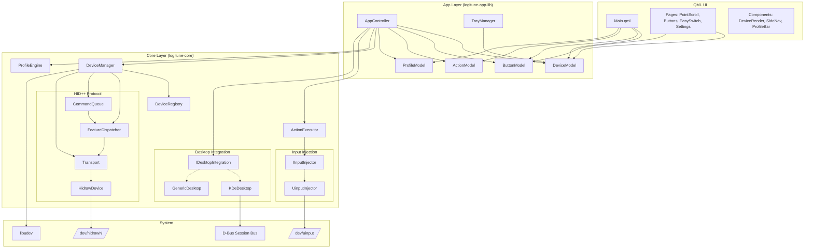

### Two Static Libraries

The project is split into two static libraries:

| Library | Contents | Dependencies |
|---------|----------|-------------|
| `logitune-core` | DeviceManager, HID++ protocol, ProfileEngine, ActionExecutor, device descriptors, desktop integration, input injection, logging | Qt6::Core, Qt6::DBus, libudev |
| `logitune-app-lib` | AppController, models (DeviceModel, ButtonModel, ActionModel, ProfileModel), TrayManager, QML module, dialogs | logitune-core, Qt6::Quick, Qt6::Widgets |

This split allows tests to link against `logitune-core` and `logitune-app-lib` without pulling in the executable's `main()`.

## Signal Flow

### Window Focus Change -> Profile Switch -> Hardware Commands

This is the central flow of the application. When the user switches to a different window, the active profile changes and hardware settings are updated.

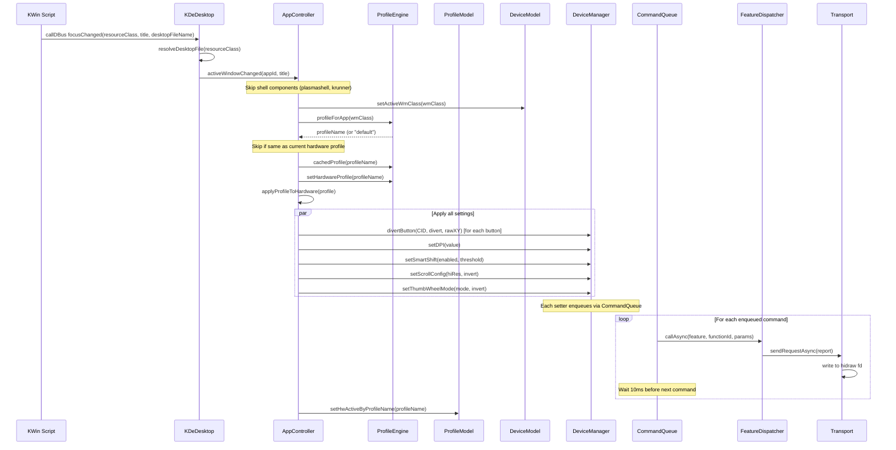

### Key Design Decision: Display vs Hardware Profile

The ProfileEngine maintains two independent profile pointers:

- **displayProfile** — the profile the user is currently viewing/editing in the UI
- **hardwareProfile** — the profile currently applied to the device hardware

These can differ. When the user clicks a profile tab, only the display profile changes (UI updates, no hardware writes). When the focused window changes, the hardware profile changes (hardware writes, and if the user was viewing a different tab, the UI stays on that tab).

This prevents accidental hardware writes when the user is just browsing profiles.

## HID++ Protocol Layer

### Stack

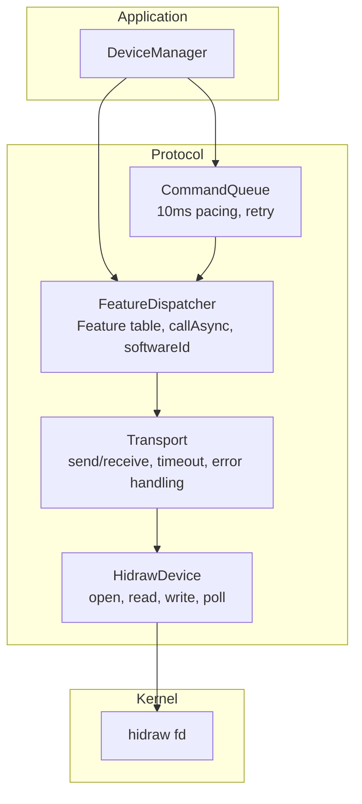

### Feature Discovery

On device connect, `FeatureDispatcher::enumerate()` queries the Root feature (0x0000) to build a feature index table:

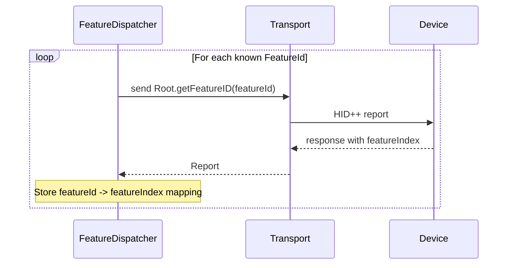

The feature table maps `FeatureId` enums to device-assigned 8-bit indices. For example, `FeatureId::AdjustableDPI (0x2201)` might map to index `0x07` on one device and `0x09` on another. All subsequent calls use the resolved index.

Known features (from `HidppTypes.h`):

| Feature | ID | Description |
|---------|-----|-------------|
| Root | `0x0000` | Feature discovery |
| FeatureSet | `0x0001` | List all features |
| DeviceName | `0x0005` | Read device name string |
| BatteryStatus | `0x1000` | Battery level (legacy format, MX Master 2S and older) |
| BatteryUnified | `0x1004` | Battery level and charging status (MX Master 3S+) |
| ChangeHost | `0x1814` | Easy-Switch host info |
| ReprogControlsV4 | `0x1b04` | Button diversion and remapping |
| SmartShift | `0x2110` | SmartShift V1 ratchet/freespin control |
| SmartShiftEnhanced | `0x2111` | SmartShift V2 (MX Master 4, different function IDs) |
| HiResWheel | `0x2121` | Scroll wheel mode and ratchet |
| ThumbWheel | `0x2150` | Thumb wheel diversion and direction |
| AdjustableDPI | `0x2201` | DPI range and current value |
| GestureV2 | `0x6501` | Gesture engine (reserved) |

Features with multiple variants (Battery, SmartShift) are resolved at enumeration time via capability dispatch tables in `src/core/hidpp/capabilities/`. DeviceManager stores the resolved variant and uses it everywhere, so adding new variants requires only a table entry with zero DeviceManager changes.

### Command Queue

The CommandQueue exists to solve a specific problem: **HwError flooding**.

When a profile switch happens, Logitune needs to send many HID++ commands in rapid succession (divert 6 buttons + set DPI + set SmartShift + set scroll config + set thumb wheel = ~10 commands). Sending them all at once causes `HwError` (error code `0x04`) responses because the device's internal command processor cannot keep up.

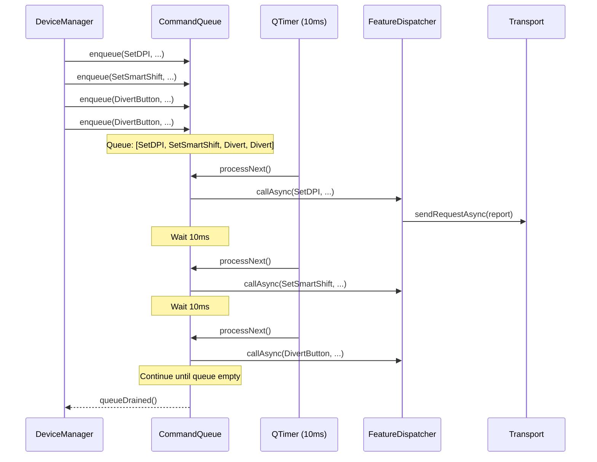

Key properties:

- **10ms inter-command delay** (`kInterCommandDelayMs = 10`) — enough for the device to process each command
- **3 retries** (`kMaxRetries = 3`) with 50ms retry delay
- **Main thread only** — uses `QTimer`, no mutex needed, no fd contention with `QSocketNotifier`
- **Created after feature enumeration** — the command queue is instantiated inside `enumerateAndSetup()` after the feature table is populated

### Async Response Matching

`FeatureDispatcher::callAsync()` uses a rotating `softwareId` (1-15) to match responses to requests:

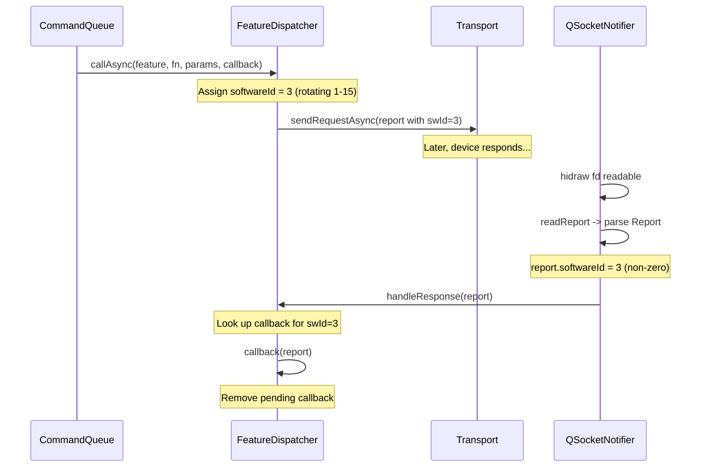

The `softwareId` field (lower 4 bits of byte[3] in HID++ reports) distinguishes responses from notifications:

- **softwareId = 0** — unsolicited notification from the device (battery change, button press, wheel rotation)
- **softwareId 1-15** — response to a specific request sent by the host

This was a critical fix: without it, async responses from thumb wheel SetReporting were being misinterpreted as thumb wheel rotation events (the "delta=256 bug").

## Profile System

### Profile Struct

```cpp
struct Profile {
    int version = 1;
    QString name;
    QString icon;
    int dpi = 1000;
    bool smartShiftEnabled = true;
    int smartShiftThreshold = 128;
    bool smoothScrolling = false;
    QString scrollDirection = "standard";  // "standard" or "natural"
    bool hiResScroll = true;
    std::array<ButtonAction, 16> buttons;  // indexed by ControlDescriptor::buttonIndex
    std::map<QString, ButtonAction> gestures;  // "up","down","left","right","click"
    QString thumbWheelMode = "scroll";  // "scroll", "zoom", "volume", "none"
    bool thumbWheelInvert = false;
};
```

### ProfileEngine

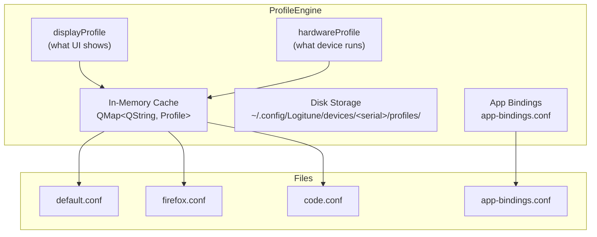

### Profile Lifecycle

1. **Device connects** — `onDeviceSetupComplete()` creates the profile directory under `~/.config/Logitune/devices/<serial>/profiles/`
2. **First connect** — seeds `default.conf` from current device hardware state (DPI, SmartShift, scroll config, button defaults from descriptor, default gestures)
3. **Profile load** — `setDeviceConfigDir()` scans the directory for `.conf` files and loads them into the in-memory cache
4. **Focus change** — `profileForApp(wmClass)` looks up the app binding; if none found, returns "default"
5. **Hardware apply** — `applyProfileToHardware()` sends all profile settings via CommandQueue
6. **User edit** — UI changes go through DeviceModel -> AppController -> ProfileEngine cache -> disk save
7. **Cache vs disk** — the cache is the source of truth during runtime; saves to disk are immediate but loads only happen at startup

### ProfileDelta

The `ProfileDelta` struct tracks which fields changed between two profiles:

```cpp
struct ProfileDelta {
    bool dpiChanged = false;
    bool smartShiftChanged = false;
    bool scrollChanged = false;
    bool buttonsChanged = false;
    bool gesturesChanged = false;
};
```

This enables future optimizations where only changed settings are sent to hardware during profile switches.

## MVVM Pattern

Logitune uses a Model-View-ViewModel pattern where C++ models serve as the ViewModel layer between QML views and core logic.

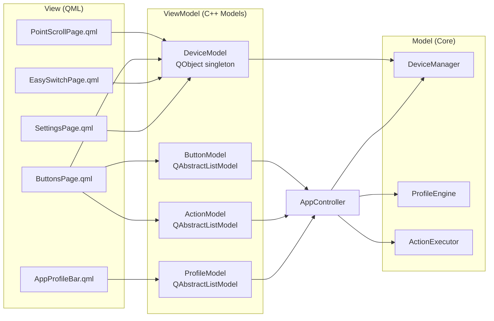

### Model Roles

**DeviceModel** — QObject singleton exposed to QML. Provides:

- Device state (connected, name, battery, connection type)
- Settings (DPI, SmartShift, scroll, thumb wheel)
- Device descriptor info (images, hotspots, Easy-Switch slots)
- Display values that may differ from hardware (when viewing non-active profile)
- Logging control (enable/disable, bug report)

**ButtonModel** — `QAbstractListModel` with roles:

| Role | Type | Description |
|------|------|-------------|
| `ButtonIdRole` | int | Button index (0-7) |
| `ButtonNameRole` | QString | Display name from device descriptor |
| `ActionNameRole` | QString | Current action display name |
| `ActionTypeRole` | QString | Action type: "default", "keystroke", "gesture-trigger", etc. |

**ActionModel** — `QAbstractListModel` catalog of available actions:

| Role | Type | Description |
|------|------|-------------|
| `NameRole` | QString | Display name (e.g., "Copy") |
| `DescriptionRole` | QString | Help text |
| `ActionTypeRole` | QString | "default", "keystroke", "app-launch", etc. |
| `PayloadRole` | QString | Keystroke combo or app command |

**ProfileModel** — `QAbstractListModel` for the profile tab bar:

| Role | Type | Description |
|------|------|-------------|
| `NameRole` | QString | Profile display name |
| `IconRole` | QString | Application icon name |
| `WmClassRole` | QString | Window manager class for app binding |
| `IsActiveRole` | bool | User's selected tab |
| `IsHwActiveRole` | bool | Currently active on hardware |

### Model Registration

Models are registered as QML singletons in `main.cpp`:

```cpp
qmlRegisterSingletonInstance("Logitune", 1, 0, "DeviceModel",  controller.deviceModel());
qmlRegisterSingletonInstance("Logitune", 1, 0, "ButtonModel",  controller.buttonModel());
qmlRegisterSingletonInstance("Logitune", 1, 0, "ActionModel",  controller.actionModel());
qmlRegisterSingletonInstance("Logitune", 1, 0, "ProfileModel", controller.profileModel());
```

## Desktop Integration

### Interface Hierarchy

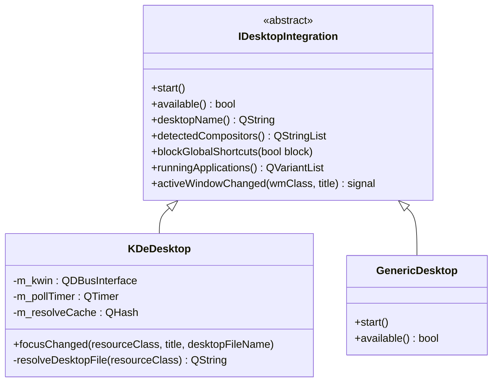

### KDE Focus Tracking

KDeDesktop uses a KWin script to track window focus changes:


### Window Identity Resolution

A critical problem: the same application can have different identifiers depending on how it's packaged:

- Zoom: `resourceClass="zoom"`, but `.desktop` file is `us.zoom.Zoom.desktop`
- Firefox: `desktopFileName="org.mozilla.firefox"`
- Native KDE apps: `desktopFileName="org.kde.dolphin"`

`resolveDesktopFile()` searches these directories:

1. `/usr/share/applications`
2. `~/.local/share/applications`
3. `/var/lib/flatpak/exports/share/applications` (Flatpak apps installed on the host)
4. `~/.local/share/flatpak/exports/share/applications`
5. `/var/lib/snapd/desktop/applications`

It matches by:
1. Last component of the `.desktop` filename (e.g., "Zoom" from "us.zoom.Zoom")
2. `StartupWMClass` field in the `.desktop` file

Results are cached in `m_resolveCache` to avoid repeated filesystem scans.

### blockGlobalShortcuts

During keystroke capture (when the user is pressing a key combo to assign to a button), KDE global shortcuts are temporarily disabled via:

```cpp
QDBusMessage msg = QDBusMessage::createMethodCall(
    "org.kde.kglobalaccel", "/kglobalaccel",
    "org.kde.KGlobalAccel", "blockGlobalShortcuts");
msg << block;
QDBusConnection::sessionBus().call(msg, QDBus::NoBlock);
```

This prevents Ctrl+Super+Left (assigned to "switch desktop left") from actually switching desktops while the user is trying to capture it as a button binding.

## Device Discovery and Connection

### Discovery Flow

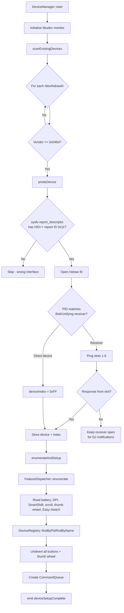

### Report Descriptor Check

Before opening a hidraw device, Logitune checks the sysfs report descriptor for the HID++ long report ID (`0x11`). This is critical because:

- Each HID device exposes multiple hidraw interfaces (keyboard, mouse, vendor-specific)
- Opening and writing to the wrong interface can "poison" sibling interfaces
- The sysfs check at `/sys/class/hidraw/hidrawN/device/report_descriptor` avoids this without opening the fd

### Bolt Receiver Slot Probing

For receiver connections, Logitune pings device indices 1-6 with a HID++ 2.0 Root feature request. The receiver may respond with:

- HID++ 2.0 long report (success)
- HID++ 1.0 short report (legacy device)
- HID++ 1.0 error with code 0x09 (no device on slot)
- HID++ 2.0 error (device not present)

If no device is found on any slot, the receiver fd is kept open and a `QSocketNotifier` watches for incoming traffic, indicating a device has connected.

## Disconnect and Reconnect

### Bolt Receiver DJ Notifications

When a device disconnects from a Bolt receiver (e.g., turned off, moved out of range), the receiver sends a HID++ 1.0 DeviceConnection notification (register `0x41`):

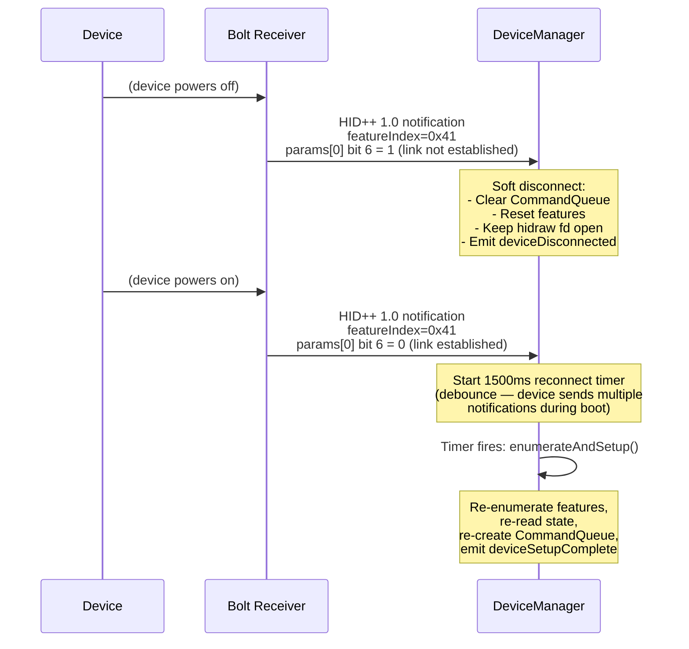

Key details:

- **Soft disconnect** — the hidraw fd stays open. Only logical state (features, command queue, connected flag) is reset.
- **1500ms debounce** — the device sends multiple DJ notifications during boot, and HID++ calls fail with HwError if sent too early.
- **Reconnect timer cancellation** — if multiple link-established notifications arrive, only the last one triggers re-enumeration.

### Transport Failover

When a device is connected via both Bolt and Bluetooth:

1. New hidraw device appears via udev "add" event
2. DeviceManager pings the current device
3. If the current device is unresponsive, switches to the new transport
4. Emits `transportSwitched(newType)`

### Sleep/Wake Detection

`checkSleepWake()` monitors the gap between HID++ responses. If no response has been received for 2 minutes (`kSleepThresholdMs = 120000`), the device is assumed to have been sleeping. On the next response:

1. Wait 500ms for the device to fully wake
2. Re-enumerate features (firmware may have reset state)
3. Emit `deviceWoke()`

The `touchResponseTime()` method is called before intentional hardware writes to prevent false sleep/wake detection during profile switches.

## Gesture System

The gesture system intercepts raw mouse XY deltas when the gesture button is held down:

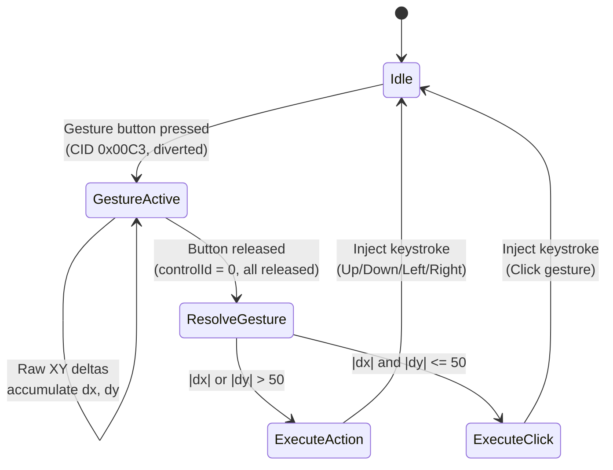

Direction resolution:

- If `|dx| > |dy|`: Left (dx < 0) or Right (dx > 0)
- If `|dy| > |dx|`: Up (dy < 0) or Down (dy > 0)
- If neither exceeds threshold (50 units): Click

The gesture button (CID `0x00C3` on MX Master 3S) is diverted with `rawXY=true`, which causes the device to send `DivertedRawXYEvent` notifications instead of normal mouse movement.

## Thumb Wheel

### Mode Processing

The thumb wheel supports four modes:

| Mode | HID++ | Action |
|------|-------|--------|
| `scroll` | Not diverted | Native horizontal scroll (no software processing) |
| `zoom` | Diverted | Ctrl+scroll injection (Ctrl held + vertical scroll event) |
| `volume` | Diverted | VolumeUp/VolumeDown key injection |
| `none` | Not diverted | No action |

When diverted, the device sends thumb wheel rotation events with raw delta values. These are:

1. **Normalized** by `thumbWheelDefaultDirection` (read from ThumbWheel GetInfo) so clockwise = positive
2. **Accumulated** in `m_thumbAccum`
3. **Thresholded** at `kThumbThreshold = 15` to convert continuous rotation into discrete steps
4. **Executed** as the appropriate action for each step

### Direction Normalization

The MX Master 3S reports `defaultDirection = 0` (positive when left/back), so `thumbWheelDefaultDirection = -1`. Multiplying raw deltas by -1 makes clockwise = positive, which is the natural direction for zoom-in and volume-up.

## AppController Wiring

AppController is the central orchestrator. It owns all subsystems and wires them together:

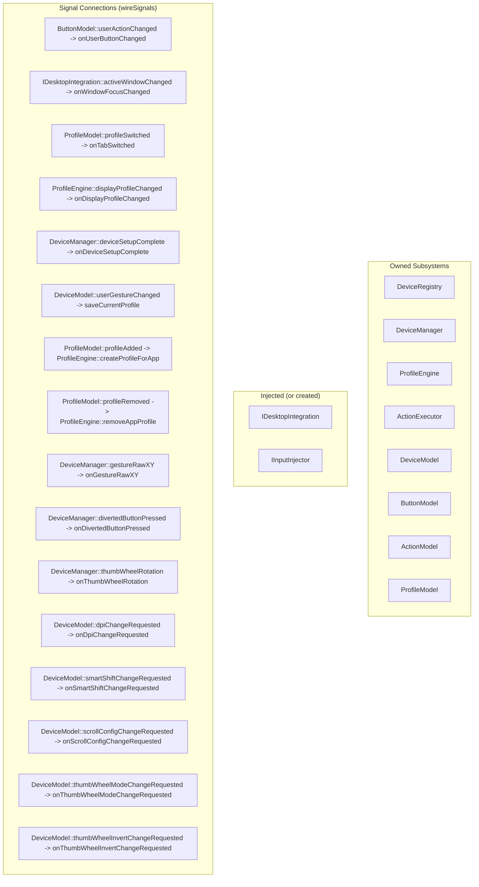

### Dependency Injection

AppController accepts optional `IDesktopIntegration*` and `IInputInjector*` in its constructor:

```cpp
AppController(IDesktopIntegration *desktop, IInputInjector *injector, QObject *parent = nullptr);
```

- If `nullptr` is passed (production), it creates `KDeDesktop` and `UinputInjector` internally
- In tests, `MockDesktop` and `MockInjector` are injected for deterministic behavior
- The injected pointers are **not owned** by AppController (raw pointers); internally created ones are held in `unique_ptr`

This is the sole DI point — the rest of the subsystems are value members of AppController, which simplifies lifetime management.
