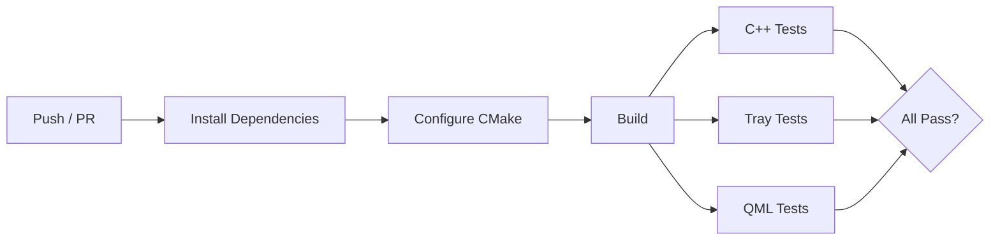
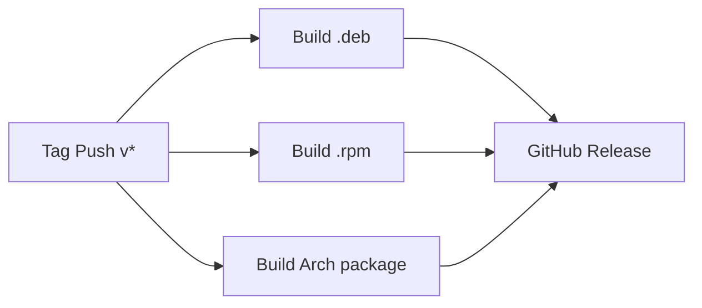

# Building

## Prerequisites

| Dependency | Version | Notes |
|-----------|---------|-------|
| CMake | >= 3.22 | Build system |
| Ninja | any | Recommended generator (make works too) |
| C++ compiler | C++20 | GCC 12+ or Clang 15+ |
| Qt 6 | >= 6.4 | Core, Quick, Svg, DBus, Widgets, Concurrent, Test, QuickTest |
| libudev | any | Device discovery via udev/hidraw |
| Google Test | any | Test framework (Ubuntu ships source only — needs manual build) |
| pkg-config | any | Finds libudev |

### Qt 6 Modules

The project uses these Qt 6 modules (from `CMakeLists.txt`):

```cmake
find_package(Qt6 REQUIRED COMPONENTS Core Quick Svg DBus Widgets Concurrent Test QuickTest)
```

Plus these QML modules at runtime:

- `qml6-module-qtquick`, `qml6-module-qtquick-controls`, `qml6-module-qtquick-layouts`
- `qml6-module-qtquick-window`, `qml6-module-qtquick-templates`
- `qml6-module-qtquick-dialogs`, `qml6-module-qt5compat-graphicaleffects`
- `qml6-module-qttest` (for QML tests)

> The canonical lists live in `.github/workflows/ci.yml`. If something
> below drifts, the CI file wins — it's what actually builds every PR.

### Ubuntu 24.04

```bash
sudo apt-get install -y \
    cmake ninja-build g++ git pkg-config \
    qt6-base-dev qt6-declarative-dev qt6-svg-dev \
    qt6-base-dev-tools qt6-declarative-dev-tools \
    qml6-module-qtquick qml6-module-qtquick-controls \
    qml6-module-qtquick-layouts qml6-module-qtquick-window \
    qml6-module-qtquick-templates qml6-module-qtqml-workerscript \
    qml6-module-qtquick-dialogs qml6-module-qt5compat-graphicaleffects \
    qt6-qpa-plugins libqt6opengl6-dev libqt6svg6-dev \
    libxkbcommon-dev qml6-module-qttest libudev-dev libgtest-dev

# Build and install GTest (Ubuntu ships source only)
cd /usr/src/googletest && sudo cmake -B build && sudo cmake --build build && sudo cmake --install build
```

### Fedora 42

```bash
sudo dnf install -y \
    cmake ninja-build gcc-c++ git pkgconf-pkg-config \
    qt6-qtbase-devel qt6-qtdeclarative-devel qt6-qtsvg-devel \
    qt6-qtshadertools systemd-devel gtest-devel
```

### Arch Linux

```bash
sudo pacman -S --needed \
    cmake ninja gcc git pkgconf \
    qt6-base qt6-declarative qt6-svg \
    systemd-libs gtest
```

## Build from Source

```bash
git clone https://github.com/logitune/logitune.git
cd logitune

# Configure + build
make build

# Run with debug logging
make run
```

The `make build` target runs:

```bash
cmake -B build -DCMAKE_BUILD_TYPE=Debug -DCMAKE_EXPORT_COMPILE_COMMANDS=ON -Wno-dev
cmake --build build -j$(nproc)
```

## Build Commands

The Makefile provides these targets:

| Command | Description |
|---------|-------------|
| `make build` | Build the project (Debug mode) |
| `make run` | Build and run the app with `--debug` (host only) |
| `make test` | Run C++ unit/integration tests |
| `make test-qml` | Run QML component tests |
| `make test-tray` | Run tray manager tests |
| `make test-all` | Run all test tiers |
| `make package-deb` | Build a `.deb` package |
| `make package-rpm` | Build an `.rpm` package |
| `make package-arch` | Build an Arch package |
| `make install` | Install to system (`/usr/local`) |
| `make uninstall` | Remove system install |
| `make release` | Version bump, tag, push |
| `make setup-hooks` | Install git pre-push hook (now a no-op: `cmake -B build` auto-activates `hooks/` via `core.hooksPath`) |
| `make clean` | Remove build artifacts |
| `make help` | Show all targets |

## CMake Options

| Option | Default | Description |
|--------|---------|-------------|
| `BUILD_TESTING` | `ON` | Build test binaries |
| `BUILD_HW_TESTING` | `OFF` | Build hardware integration tests (requires connected device) |
| `CMAKE_BUILD_TYPE` | `Debug` | `Debug` or `Release` |

## Project Structure

```
logitune/
├── CMakeLists.txt              # Root CMake — project, Qt find, subdirs
├── Makefile                    # Developer convenience targets
├── data/
│   ├── 71-logitune.rules       # udev rules for hidraw + uinput
│   ├── com.logitune.Logitune.desktop
│   ├── com.logitune.Logitune.metainfo.xml
│   └── com.logitune.Logitune.svg
├── src/
│   ├── core/                   # Static library: logitune-core
│   │   ├── CMakeLists.txt
│   │   ├── DeviceManager.cpp/h # Device lifecycle, HID++ orchestration
│   │   ├── DeviceRegistry.cpp/h
│   │   ├── ProfileEngine.cpp/h # Profile CRUD, app bindings, cache
│   │   ├── ActionExecutor.cpp/h
│   │   ├── ButtonAction.h
│   │   ├── hidpp/              # HID++ protocol layer
│   │   │   ├── HidppTypes.h    # Report, FeatureId, ErrorCode
│   │   │   ├── HidrawDevice.h  # Raw hidraw fd wrapper
│   │   │   ├── Transport.h     # Send/receive with timeout + retry
│   │   │   ├── FeatureDispatcher.h  # Feature table, call(), callAsync()
│   │   │   ├── CommandQueue.h  # Paced sequential command sending
│   │   │   └── features/       # Per-feature param builders + parsers
│   │   ├── devices/
│   │   │   └── MxMaster3sDescriptor.cpp/h
│   │   ├── interfaces/
│   │   │   ├── IDevice.h       # Device descriptor interface
│   │   │   ├── IDesktopIntegration.h
│   │   │   ├── IInputInjector.h
│   │   │   └── ITransport.h
│   │   ├── desktop/
│   │   │   ├── KDeDesktop.cpp/h    # KDE/KWin integration
│   │   │   └── GenericDesktop.cpp/h
│   │   ├── input/
│   │   │   └── UinputInjector.cpp/h
│   │   └── logging/
│   │       ├── LogManager.cpp/h
│   │       └── CrashHandler.cpp/h
│   └── app/                    # Static library: logitune-app-lib + executable
│       ├── CMakeLists.txt
│       ├── main.cpp            # Entry point, QML engine, tray
│       ├── AppController.cpp/h # Main orchestrator
│       ├── TrayManager.cpp/h
│       ├── models/
│       │   ├── DeviceModel.h   # QML-facing device state
│       │   ├── ButtonModel.h   # QAbstractListModel for buttons
│       │   ├── ActionModel.h   # Available actions catalog
│       │   └── ProfileModel.h  # Profile tabs
│       ├── dialogs/
│       │   ├── CrashReportDialog.cpp/h
│       │   └── GitHubIssueBuilder.cpp/h
│       └── qml/
│           ├── Main.qml
│           ├── Theme.qml       # Singleton with design tokens
│           ├── HomeView.qml
│           ├── DeviceView.qml
│           ├── pages/          # PointScrollPage, ButtonsPage, EasySwitchPage, SettingsPage
│           ├── components/     # SideNav, BatteryChip, DeviceRender, etc.
│           └── assets/         # Device images (PNG)
├── tests/
│   ├── CMakeLists.txt
│   ├── test_main.cpp           # GTest main with QCoreApplication
│   ├── helpers/
│   │   ├── TestFixtures.h      # ProfileFixture, ensureApp()
│   │   └── AppControllerFixture.h  # Full integration test fixture
│   ├── mocks/
│   │   ├── MockDesktop.h/cpp
│   │   ├── MockTransport.h/cpp
│   │   ├── MockInjector.h/cpp
│   │   └── MockDevice.h
│   ├── test_*.cpp              # C++ test files
│   ├── qml/
│   │   ├── tst_*.qml           # QML component tests
│   │   └── tst_qml_main.cpp
│   └── hw/
│       ├── HardwareFixture.h
│       ├── hw_test_main.cpp
│       └── test_hw_*.cpp       # Hardware integration tests
├── scripts/
│   ├── pre-push                # (moved to hooks/pre-push; see below)
│   └── release.sh
└── .github/workflows/
    ├── ci.yml                  # Build + test on push/PR
    └── release.yml             # Native packages on tag push
```

## Native Package Builds

### Ubuntu / Debian (.deb)

```bash
make package-deb
sudo apt install ./logitune-VERSION_amd64.deb
```

The `.deb` package installs the binary, udev rules (`71-logitune.rules`), and `.desktop` file. udev rules are activated automatically on install, so no manual `udevadm` steps are required.

### Fedora / RHEL (.rpm)

```bash
make package-rpm
sudo dnf install logitune-VERSION.rpm
```

### Arch Linux

```bash
make package-arch   # builds with makepkg
```

Or install from AUR directly. The package installs udev rules and reloads them via a `post_install` hook.

### System Install from Source

```bash
make install    # installs to /usr/local, copies udev rules, reloads udev
make uninstall  # removes all installed files
```

## Devcontainer / GitHub Codespaces

The repository includes a devcontainer configuration for one-click development in VS Code or GitHub Codespaces.

### What's Included

The Dockerfile (`/.devcontainer/Dockerfile`) builds an Ubuntu 24.04 container with:

- All build dependencies (Qt 6, CMake, Ninja, GTest, libudev)
- Development tools (clangd, gdb, fish shell, bat, eza, ripgrep, fzf)
- Nerd Font for terminal icons
- `QT_QPA_PLATFORM=offscreen` for headless testing

### VS Code Extensions

The devcontainer auto-installs:

- `llvm-vs-code-extensions.vscode-clangd` — C++ language server
- `ms-vscode.cmake-tools` — CMake integration
- `theqtcompany.qt`, `theqtcompany.qt-qml`, `theqtcompany.qt-cpp` — Qt/QML support
- `vscode-icons-team.vscode-icons` — file icons

### Post-Create

On container creation, `postCreateCommand` runs:

```bash
make setup-hooks
sudo rm -rf build
cmake -B build -G Ninja -DCMAKE_BUILD_TYPE=Debug -DCMAKE_EXPORT_COMPILE_COMMANDS=ON
cmake --build build -j$(nproc)
```

> The `sudo rm -rf build` clears any host-side build directory that
> might have leaked in through the bind mount before running a fresh
> in-container configure.

So the project is fully built and ready to test immediately after the container starts.

### Limitations

The devcontainer runs headless (`QT_QPA_PLATFORM=offscreen`), so:

- All tests run fine (C++, QML, tray)
- You cannot run the GUI application visually
- No hidraw access (no physical device tests)

## CI Pipeline

The CI workflow (`.github/workflows/ci.yml`) runs on every push to `master` and every pull request:



The release workflow (`.github/workflows/release.yml`) triggers on version tags (`v*`):



It builds native packages for each distro family and creates a GitHub Release with auto-generated release notes.
