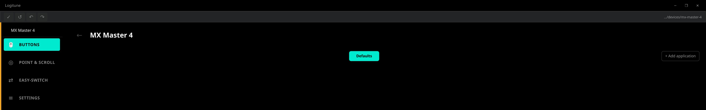
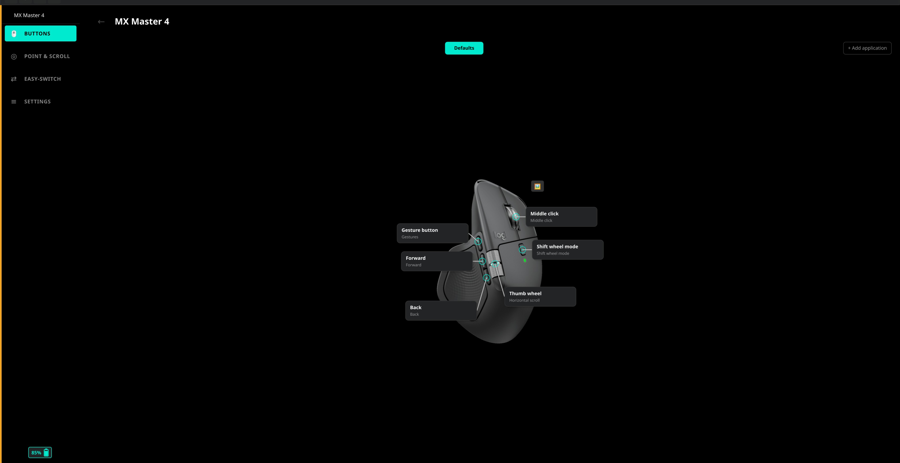
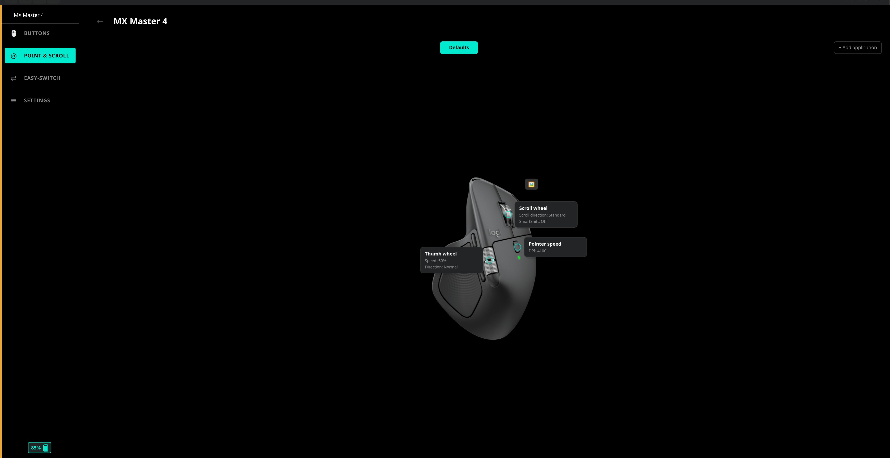
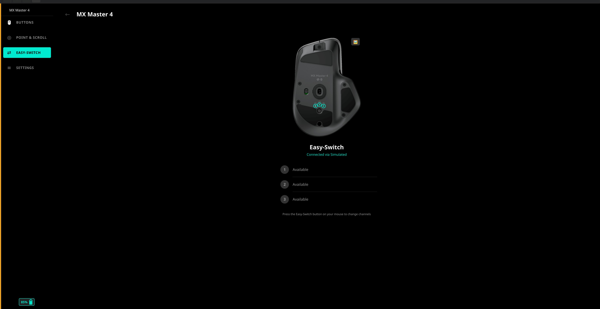
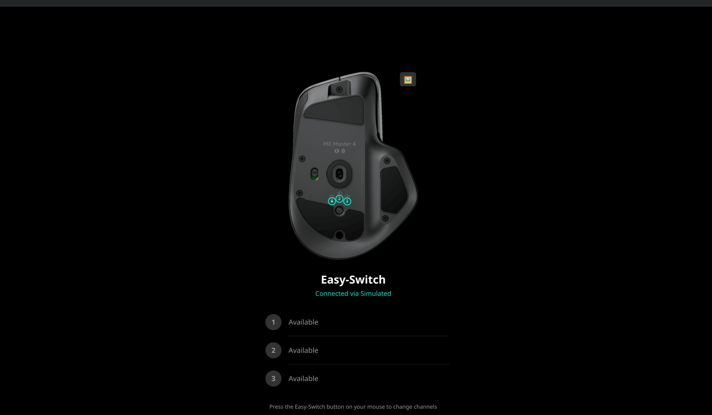
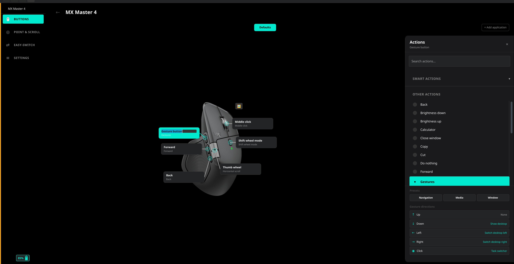
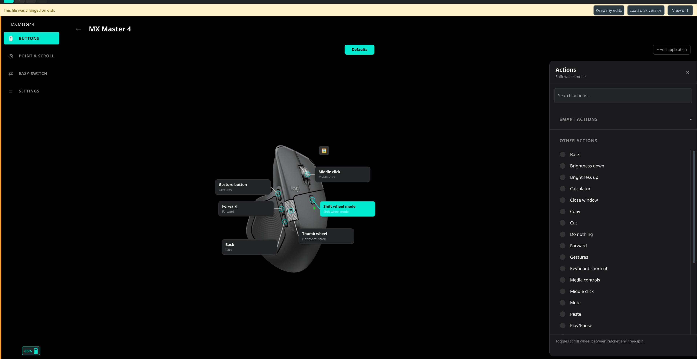
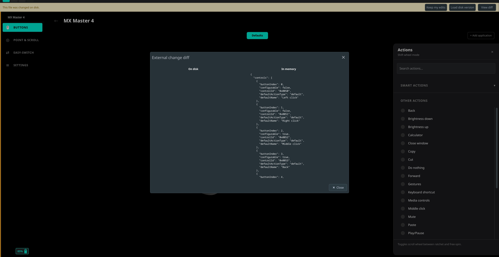
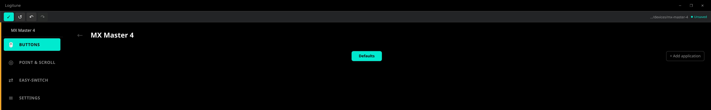

# Editor Mode

Editor Mode is a visual editor built into Logitune that lets you refine the layout of an existing device descriptor without touching JSON by hand. It is invoked with `--edit` and operates on files already present in `devices/<slug>/`. It cannot create a descriptor from scratch: a valid `descriptor.json` (with correct PIDs, CIDs, features, and DPI range) must exist before the editor can open the device.

---

## When to use it

Use Editor Mode after you have bootstrapped `descriptor.json` by hand and confirmed it parses without errors (see [Adding a Device](Adding-a-Device)). Specifically, use it to:

- Drag hotspot markers to the correct positions on the device image.
- Drag callout cards to a comfortable reading position on the same page.
- Drag Easy-Switch slot circles to their correct positions on the back-view image.
- Upload real device images to replace placeholder PNGs.
- Rename control labels or slot labels in place.

These are the refinements that are much faster to do visually than by editing percentages in JSON.

---

## Launching

**With hardware connected:**

```bash
logitune --edit
```

**Without hardware (simulate all devices):**

```bash
logitune --edit --simulate-all
```

`--simulate-all` loads all descriptors in simulation mode, bypassing the HID++ layer. Use it when you are contributing a descriptor for a device you do not own, or when you want to iterate quickly without a live connection.

---

## The editor toolbar



When `--edit` is active, a toolbar appears at the top of the device view area. It contains four action buttons on the left:

| Button | Action |
|--------|--------|
| Save (check mark) | Write the in-memory descriptor to disk. Enabled only when there are unsaved changes. |
| Reset (counter-clockwise arrow) | Discard all in-memory edits and reload the on-disk file. Enabled only when there are unsaved changes. |
| Undo (left-curved arrow) | Undo the last edit command. Per-device undo stack; independent for each device in the carousel. |
| Redo (right-curved arrow) | Reapply the last undone command. |

On the right side of the toolbar, a truncated path (`.../<slug>/descriptor.json`) shows which descriptor is currently active. When there are unsaved changes, a small amber dot and the label "Unsaved" appear next to the path.

Along the left edge of the sidebar, a 4 px amber stripe (`#F5A623`) is visible whenever Editor Mode is active, providing a persistent at-a-glance indicator regardless of which page you are on.

---

## Buttons page



The Buttons page shows the device side image with one `HotspotControl` per configurable button. Each control consists of a circular marker pinned to the device image, a connector line, and a callout card showing the button name and current action.

In Editor Mode, two things become draggable:

**Marker drag:** grab the marker circle and drag it. On release, the updated `xPct`/`yPct` values (clamped to [0, 1]) are committed to the in-memory descriptor and pushed onto the undo stack.

**Card drag:** grab the callout card and drag it freely. On release, the card snaps: if the card center is on the left half of the page it snaps to the "left" column; if it is on the right half it snaps to the "right" column. The vertical offset from the marker midline is also recorded as `labelOffsetYPct`.

**Label rename:** double-click the button name text in a callout card. A text field appears in place (pre-selected). Type the new name, then press Enter or click away to commit. Press Escape to cancel. The commit updates `controls[i].displayName` in the descriptor.

The connector line redraws live as either the marker or the card moves.

---

## Point and Scroll page



The Point and Scroll page shows the device side image with one draggable marker per scroll hotspot. The descriptor supports three hotspot kinds: `scrollwheel`, `thumbwheel`, and `pointer`.

In Editor Mode, each scroll marker has a `DragHandler` enabled. Drag a marker to reposition it; on release the updated `xPct`/`yPct` values are written back via `EditorModel.updateScrollHotspot` and pushed to the undo stack. The `side` and `labelOffsetYPct` of the corresponding callout are preserved unchanged during a pure marker drag.

---

## Easy-Switch page



The Easy-Switch page shows the device back image with numbered slot circles. In production mode the circles are static. In Editor Mode each slot circle gains a `DragHandler`.

Drag a slot circle to any position on the back image. On release, the new `xPct`/`yPct` values (clamped to [0, 1]) are committed via `EditorModel.updateSlotPosition` and pushed to the undo stack.

Slot labels (the text that appears in the channel list below the image) can also be renamed by double-clicking the label text directly in the channel list.

---

## Uploading device images



Each device page that shows a device image (Buttons, Point and Scroll, Easy-Switch) supports image replacement in Editor Mode.

There are two ways to upload:

1. **Drag and drop:** drag a PNG file from your file manager and drop it onto the device image. The file must have a `.png` extension.
2. **File picker:** in Editor Mode a small icon button appears in the top-right corner of the device image. Click it to open a file dialog filtered to PNG files.

Both paths call `EditorModel.replaceImage(role, sourcePath)`, where `role` is `"front"`, `"side"`, or `"back"`. The image is copied atomically into `devices/<slug>/` as `<role>.png`, replacing any existing file. The destination path is recorded in the in-memory descriptor's `images` object and pushed onto the undo stack.

The copied file lands in your working tree under `devices/<slug>/`, so it will appear in `git status` and must be staged alongside `descriptor.json` when you submit a PR.

---

## Renaming labels



Any text rendered through the `EditableText` component supports in-place rename in Editor Mode:

- **Button names** on the Buttons page (updates `controls[i].displayName`).
- **Slot labels** on the Easy-Switch page channel list (updates `easySwitchSlots[i].label`).

To rename: double-click the text. A text field appears in place with the current value selected. Type the new value, then press Enter or click away to commit. Press Escape to revert.

Each rename is a discrete edit command, so it is undoable and redoable like any other change.

---

## Resolving file conflicts



`EditorModel` watches `descriptor.json` with `QFileSystemWatcher`. If an external process modifies the file while you have unsaved edits in memory, a yellow conflict banner appears at the top of the view:

> This file was changed on disk.

The banner offers three choices:

| Choice | Effect |
|--------|--------|
| Keep my edits | Dismiss the banner; your in-memory edits remain unchanged. |
| Load disk version | Discard in-memory edits, reload the on-disk file (calls `reset()`). |
| View diff | Open the diff modal (see below). |

If the file changes on disk but you have no unsaved edits, the app reloads the descriptor silently without showing the banner.

---

## Viewing the diff



Clicking "View diff" from the conflict banner opens a side-by-side modal ("External change diff") with two scrollable monospace panels:

- **On disk:** the current content of `descriptor.json` as read from the filesystem.
- **In memory:** the in-memory descriptor as serialized JSON (your unsaved edits).

The modal is read-only. Close it with the Close button, then choose "Keep my edits" or "Load disk version" from the conflict banner to resolve the conflict.

---

## Save, reset, and unsaved changes



**Unsaved changes indicator:** whenever the in-memory descriptor differs from the on-disk file, the toolbar shows an amber dot and "Unsaved" label. The Save and Reset buttons become active.

**Save:** calls `DescriptorWriter.write()`, which uses `QSaveFile` to write the JSON to a temporary file and atomically rename it into place. If the write fails the in-memory state is preserved and a `saveFailed` signal is emitted. On success, `DeviceRegistry` reloads the descriptor and the live UI reflects the saved state.

`DescriptorWriter` writes the complete in-memory `QJsonObject` as-is. Because the editor reads the existing `descriptor.json` into memory before the first edit and only mutates the fields it knows about, any fields it does not recognize (for example, extension fields added by a later schema version) pass through unchanged. It is therefore safe to run the editor against community descriptors that contain fields the current editor build does not know about.

**Self-write suppression:** after a successful save, `EditorModel` records the device path in a set of "self-written paths" before the write. When `QFileSystemWatcher` fires for that path, the model checks the set, removes the entry, and skips the conflict banner. This prevents the editor from treating its own save as an external conflict.

**Reset:** discards all in-memory edits for the active device (clears pending edits, undo stack, redo stack), then tells `DeviceRegistry` to reload the descriptor from disk and updates the live UI. Reset is not undoable.

---

## Contribution workflow

1. Fork the repository on GitHub and clone your fork.
2. Create a branch for your device: `git checkout -b add-mx-anywhere-3s`.
3. Follow [Adding a Device](Adding-a-Device) steps 1-3 to create the descriptor folder and fill in the bootstrap JSON by hand.
4. Launch the editor: `logitune --edit --simulate-all`.
5. Drag hotspot markers and callout cards to their correct positions.
6. Upload real device images if you have them.
7. Rename any labels that the `defaultName` values do not capture well.
8. Click Save (or press the Save button in the toolbar).
9. Review the diff: `git diff devices/<slug>/descriptor.json`.
10. Commit your changes and open a PR.

For guidance on what reviewers look for and how to set the `status` field, see [Adding a Device: Step 6 Submit a PR](Adding-a-Device#step-6-submit-a-pr).

---

## Limitations

- The editor cannot create a new descriptor from scratch. You must hand-edit `descriptor.json` to set PIDs, CIDs, feature flags, and DPI range before the editor can open the device.
- Schema fields such as `productIds`, `features`, `controls[].controlId`, `controls[].configurable`, and `dpi.min`/`dpi.max`/`dpi.step` must be edited directly in `descriptor.json`. The editor has no UI for these fields.
- Undo and redo are per-device and per-session. They do not persist across restarts.

---

## See also

- [Adding a Device](Adding-a-Device) - full end-to-end guide for adding a new device descriptor.
- [Getting Started: Device Support Status](Getting-Started#device-support-status) - what `verified` and `beta` mean and how the status affects the UI.
