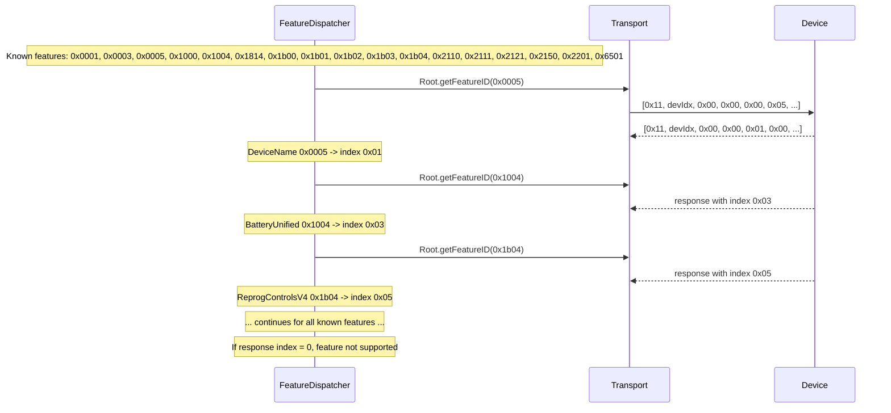
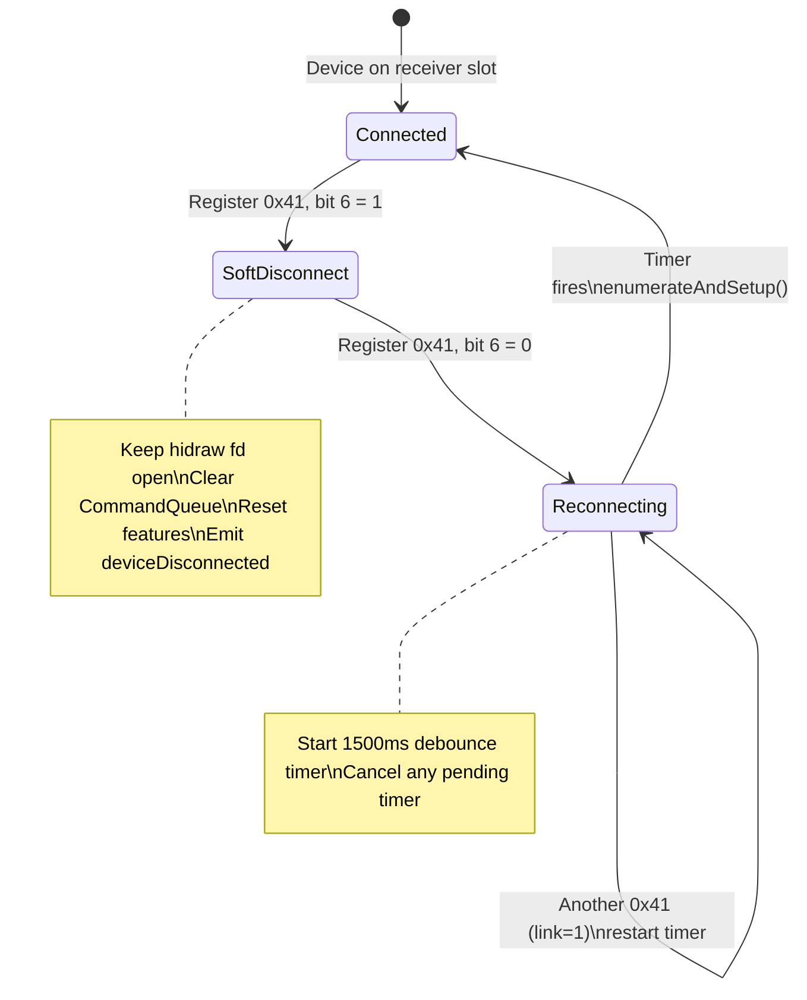
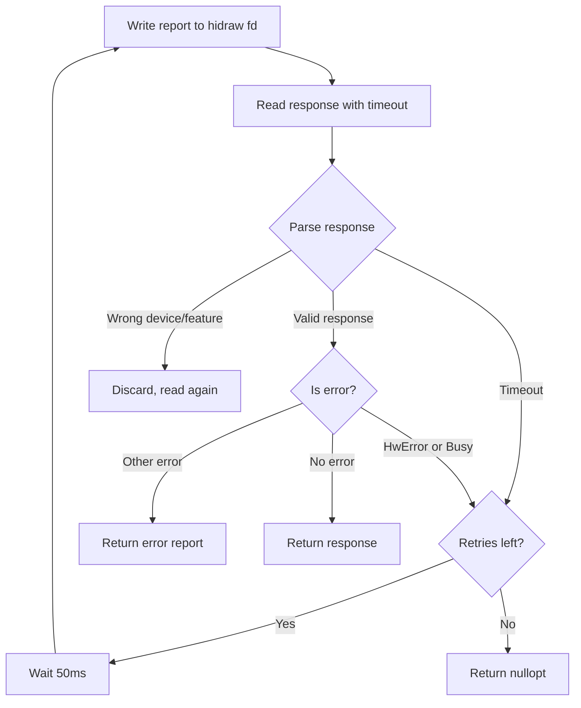

# HID++ Protocol

This page is a deep dive into the HID++ 2.0 protocol as implemented in Logitune. It covers report format, feature discovery, the features used, notification handling, and the Bolt receiver protocol.

## Report Format

HID++ 2.0 uses two report types:

### Short Report (7 bytes)

```
Byte:  [0]        [1]           [2]            [3]              [4..6]
       reportId   deviceIndex   featureIndex   funcId|swId      params (3 bytes)
       0x10
```

### Long Report (20 bytes)

```
Byte:  [0]        [1]           [2]            [3]              [4..19]
       reportId   deviceIndex   featureIndex   funcId|swId      params (16 bytes)
       0x11
```

### Field Details

| Field | Bits | Description |
|-------|------|-------------|
| `reportId` | 8 | `0x10` for short, `0x11` for long |
| `deviceIndex` | 8 | Device slot: `0xFF` for direct (USB/BT), `1-6` for receiver slots |
| `featureIndex` | 8 | Device-assigned index (NOT the feature ID — resolved via Root feature) |
| `functionId` | 4 (upper) | Function number within the feature (0-15) |
| `softwareId` | 4 (lower) | Caller identifier for response matching (0 = notification, 1-15 = request) |
| `params` | 3 or 16 | Function-specific parameters |

### Byte[3] Encoding

Byte[3] packs two 4-bit fields:

```
Byte[3] = (functionId << 4) | softwareId
```

Example: functionId=2, softwareId=5 -> byte[3] = `0x25`

### Error Report

An error response has `featureIndex = 0xFF`:

```
Byte:  [0]    [1]           [2]    [3]              [4]        [5]           [6]
       0x11   deviceIndex   0xFF   featureIndex     funcId     errorCode     0x00
```

Error codes (from `HidppTypes.h`):

| Code | Name | Description |
|------|------|-------------|
| `0x00` | NoError | Success |
| `0x01` | Unknown | Unknown error |
| `0x02` | InvalidArgument | Bad parameter value |
| `0x03` | OutOfRange | Value out of allowed range |
| `0x04` | HwError | Hardware error (device busy, command too fast) |
| `0x05` | Busy | Device is busy processing another command |
| `0x09` | Unsupported | Feature or function not supported |
| `0x0B` | InvalidAddress | Invalid memory address |

### Logitune Implementation

In `HidppTypes.h`:

```cpp
struct Report {
    uint8_t reportId{};
    uint8_t deviceIndex{};
    uint8_t featureIndex{};
    uint8_t functionId{};     // upper 4 bits of byte[3]
    uint8_t softwareId{};     // lower 4 bits of byte[3]
    std::array<uint8_t, 16> params{};
    int paramLength{};

    std::vector<uint8_t> serialize() const;
    static std::optional<Report> parse(std::span<const uint8_t> data);
    bool isError() const;
    ErrorCode errorCode() const;
};
```

## Feature Discovery

### Root Feature (0x0000)

Every HID++ 2.0 device supports the Root feature at index 0. It provides `getFeatureID` (function 0):

```
Request:  featureIndex=0x00, functionId=0, params=[featureId_hi, featureId_lo]
Response: params[0] = featureIndex (device-assigned), params[1] = featureType
```

### Enumeration Flow



The feature table is stored as `std::unordered_map<FeatureId, uint8_t>`. All subsequent calls use `FeatureDispatcher::call()` or `callAsync()`, which look up the feature index automatically.

## Key Features

### Battery Unified (0x1004)

**Functions:**

| FunctionId | Name | Params | Response |
|-----------|------|--------|----------|
| 0 | GetCapabilities | (none) | capability bits, level count |
| 1 | GetStatus | (none) | level (%), charging status |

**Response parsing (GetStatus):**

```cpp
// params[0] = battery level (0-100)
// params[1] = next level (predictive)
// params[2] = status: 0=discharging, 1-3=charging, 4=charged
```

**Notifications:** The device sends battery notifications when the level changes or charging state changes. Same format as GetStatus response.

### Battery Status (0x1000)

Legacy battery feature used by MX Master 2S and older devices. Nearly identical to Battery Unified but with a different middle byte.

**Functions:**

| FunctionId | Name | Params | Response |
|-----------|------|--------|----------|
| 0 | GetStatus | (none) | level (%), next threshold, charging status |

**Response parsing:**

```cpp
// params[0] = battery level (0-100, 0 = unknown)
// params[1] = next discharge threshold percentage (informational, ignored by Logitune)
// params[2] = status: same enum as Battery Unified (0=discharging, 1=recharging, 2=almost full, 3=full)
```

The key difference from Battery Unified: `params[1]` is the next-threshold percentage (not a level bitmask). Logitune's `Battery::parseStatusLegacy()` handles this by skipping the bitmask fallback path.

**Capability dispatch:** DeviceManager auto-detects which battery feature the device supports via `kBatteryVariants[]` table in `src/core/hidpp/capabilities/BatteryCapability.cpp`. Battery Unified is preferred when both are present.

### ReprogControlsV4 (0x1b04)

This feature controls button remapping (diversion). When a button is "diverted," the device sends its press/release events to the host software instead of performing the default action.

**Functions:**

| FunctionId | Name | Params | Response |
|-----------|------|--------|----------|
| 3 | SetControlReporting | CID_hi, CID_lo, flags | (none significant) |
| 4 | GetControlReporting | CID_hi, CID_lo | CID, flags |

**SetControlReporting flags byte (6-bit encoding):**

```
Bits 0-1: divert — 0b00 = native, 0b11 = divert to software (dvalid + divert set together)
Bits 2-3: persistent divert — same pattern (unused by Logitune)
Bits 4-5: rawXY   — 0b00 = no raw, 0b11 = raw XY (rvalid + raw set together)
```

Logitune's implementation:

```cpp
// src/core/hidpp/features/ReprogControls.cpp
std::vector<uint8_t> ReprogControls::buildSetDivert(
    uint16_t controlId, bool divert, bool rawXY)
{
    uint8_t flags = 0;
    if (divert) flags |= 0x03; // bits 0-1: divert + dvalid
    if (rawXY)  flags |= 0x30; // bits 4-5: rawXY + rvalid
    return {
        static_cast<uint8_t>(controlId >> 8),
        static_cast<uint8_t>(controlId & 0xFF),
        flags,
    };
}
```

**Notifications:**

| FunctionId | Event | Params |
|-----------|-------|--------|
| 0 | DivertedButtonEvent | CID_hi, CID_lo (0x0000 = all released) |
| 1 | DivertedRawXYEvent | dx_hi, dx_lo, dy_hi, dy_lo (int16, big-endian) |

The release event sends CID=0 (all buttons released), not the CID of the released button. This is important for gesture resolution — the gesture completes when `controlId == 0`.

### SmartShift (0x2110)

**Functions:**

| FunctionId | Name | Params | Response |
|-----------|------|--------|----------|
| 0 | GetStatus | (none) | mode, autoDisengage, default |
| 1 | SetStatus | mode, autoDisengage | (none significant) |

**Mode values:**

| Mode | Meaning |
|------|---------|
| 1 | Freespin (free-spinning scroll wheel) |
| 2 | Ratchet / SmartShift active (click-by-click scroll with auto-disengage) |

**autoDisengage:** Threshold (1-255) at which the wheel switches from ratchet to freespin during fast scrolling. Higher = more force needed to trigger freespin.

### SmartShift Enhanced (0x2111)

Used by MX Master 4 and newer devices. Same protocol as SmartShift V1 but with shifted function IDs.

**Functions:**

| FunctionId | Name | Params | Response |
|-----------|------|--------|----------|
| 0 | GetCapabilities | (none) | capabilities |
| 1 | GetStatus | (none) | mode, autoDisengage, default |
| 2 | SetStatus | mode, autoDisengage | (none significant) |

Same mode values and autoDisengage semantics as V1. The only difference is fn0 is GetCapabilities (not GetStatus), so read uses fn1 and write uses fn2.

**Capability dispatch:** DeviceManager auto-detects V1 vs Enhanced via `kSmartShiftVariants[]` table in `src/core/hidpp/capabilities/SmartShiftCapability.cpp`. V1 is preferred when both are present.

### HiResWheel (0x2121)

**Functions:**

| FunctionId | Name | Params | Response |
|-----------|------|--------|----------|
| 1 | GetWheelMode | (none) | mode byte |
| 2 | SetWheelMode | mode byte | (none significant) |
| 3 | GetRatchetSwitch | (none) | ratchet state |

**Mode byte bits:**

```
Bit 0: target (0=HID, 1=HID++)
Bit 1: resolution (0=low-res, 1=hi-res)
Bit 2: invert (0=standard, 1=inverted/natural)
Bit 3: analytics (reserved)
```

Logitune reads the full mode byte and only modifies bits 1 (hiRes) and 2 (invert), preserving the rest.

**Notifications:**

| FunctionId | Event | Params |
|-----------|-------|--------|
| 1 | RatchetSwitch | params[0]: 0=freespin, 1=ratchet |

This notification fires when the physical SmartShift button on the mouse is pressed.

### ThumbWheel (0x2150)

**Functions:**

| FunctionId | Name | Params | Response |
|-----------|------|--------|----------|
| 0 | GetConfig | (none) | resolution, capabilities, defaultDirection |
| 1 | SetConfig | divert, invert | (confirmed) |

> Older docs referred to these as `GetInfo`/`SetReporting`. The header
> (`src/core/hidpp/features/ThumbWheel.h`) names them `GetConfig`/`SetConfig`
> per the HID++ 2.0 spec for 0x2150.

**GetInfo response:**

```
params[0-1]: nativeResolution (uint16, big-endian)
params[2-3]: divertedResolution (uint16, big-endian)
params[4]:   bit 0 = defaultDirection (0=positive when left, 1=positive when right)
```

**SetReporting params:**

```
params[0]: divert (0x00=native, 0x01=diverted to software)
params[1]: invert (0x00=normal, 0x01=inverted direction)
```

**Notifications (when diverted):**

```
params[0-1]: rotation delta (int16, signed, big-endian)
```

#### Direction Normalization

The MX Master 3S has `defaultDirection = 0`, meaning positive deltas correspond to leftward/backward rotation. Logitune normalizes this:

```cpp
// In AppController::onThumbWheelRotation:
int normalized = delta * m_deviceManager.thumbWheelDefaultDirection();
// defaultDirection=0 -> thumbWheelDefaultDirection=-1
// Multiplying by -1 makes clockwise = positive
```

### AdjustableDPI (0x2201)

**Functions:**

| FunctionId | Name | Params | Response |
|-----------|------|--------|----------|
| 0 | GetSensorCount | (none) | count |
| 1 | GetSensorDpiList | sensorIdx | minDPI, maxDPI, stepDPI |
| 2 | GetSensorDpi | sensorIdx | currentDPI |
| 3 | SetSensorDpi | sensorIdx, dpi_hi, dpi_lo | (none significant) |

The MX Master 3S has one sensor (index 0) with range 200-8000 and step 50.

### GestureV2 (0x6501)

Newer-generation gesture feature used by MX Master 4 (and forward-looking descriptors). Superset of the older "hold thumb button + swipe" model with a richer per-direction event stream.

**Functions:**

| FunctionId | Name | Params | Response |
|-----------|------|--------|----------|
| 5 | SetGestureEnable | enable (0/1) | (confirmed) |

**Notification event parsing** (`GestureV2::parseGestureEvent`):

```
params[0-1]: dx (int16, big-endian horizontal delta)
params[2-3]: dy (int16, big-endian vertical delta)
params[4]:   released flag — 1 when the thumb button lifts (end of gesture stream)
```

Unlike the diverted-button + rawXY approach used for ThumbWheel, GestureV2 produces coalesced dx/dy deltas while the gesture button is held and emits a single "released" event at the end. AppController accumulates deltas and thresholds them to turn continuous motion into up/down/left/right/click bindings.

### ChangeHost (0x1814)

**Functions:**

| FunctionId | Name | Params | Response |
|-----------|------|--------|----------|
| 0 | GetHostInfo | (none) | hostCount, currentHost |
| 2 | GetCookies | (none) | cookie bytes (non-zero = paired) |

Used to display Easy-Switch host info. `GetCookies` returns one byte per host slot — a non-zero value indicates the slot is paired with a host.

### DeviceName (0x0005)

**Functions:**

| FunctionId | Name | Params | Response |
|-----------|------|--------|----------|
| 0 | GetNameLength | (none) | name length in bytes |
| 1 | GetName | offset_hi, offset_lo | up to 13 bytes of name |

The device name is read in 13-byte chunks. For the MX Master 3S, the name is "MX Master 3S" (12 bytes, one chunk).

## Bolt Receiver Protocol

### DeviceConnection Notifications (Register 0x41)

When a device connects or disconnects from a Bolt or Unifying receiver, the receiver sends a HID++ 1.0 notification with register `0x41`:

```
Byte:  [0]    [1]           [2]    [3]       [4]           [5]        [6]
       0x10   deviceIndex   0x41   ??        flags         ??         ??
```

**flags (params[0]):**

```
Bit 6: link (0 = established, 1 = not established)
```

### Handling in Logitune



Key behavior:

- **Soft disconnect**: The hidraw fd stays open. Only logical state is reset. This allows detecting when the device reconnects on the same receiver.
- **1500ms debounce**: Multiple DeviceConnection notifications arrive during device boot. Sending HID++ calls too early results in HwError. The 1500ms delay ensures the device is ready.
- **Timer cancellation**: If multiple "link established" notifications arrive, only the last one triggers re-enumeration.

### Receiver Slot Probing

When a Bolt receiver is found but no device is on any slot, Logitune keeps the receiver fd open and watches for incoming traffic:

```cpp
// QSocketNotifier on receiver fd
// Any HID++ traffic from device index 1-6 means a device appeared
if (bytes.size() >= 3 && bytes[1] >= 1 && bytes[1] <= 6) {
    // Device arrived — disconnect current transport, probe receiver again
}
```

## softwareId for Async Response Matching

### The Problem

When using `callAsync()` (fire-and-forget write), the response arrives later via the `QSocketNotifier` on the hidraw fd. Without a way to distinguish responses from notifications, the response gets misinterpreted.

Example bug: thumb wheel SetReporting (`function 0x02`) sends a response with `featureIndex` matching ThumbWheel. If `softwareId` is 0, this looks like a thumb wheel rotation notification with `delta = 256` (the SetReporting confirmation bytes interpreted as rotation).

### The Solution

`FeatureDispatcher::callAsync()` assigns a rotating `softwareId` (1-15):

```cpp
uint8_t FeatureDispatcher::nextSoftwareId() {
    uint8_t id = m_nextSwId;
    m_nextSwId = (m_nextSwId % 15) + 1;  // rotate 1-15
    return id;
}
```

In `DeviceManager::handleNotification()`, the first check is:

```cpp
if (report.softwareId != 0) {
    if (m_features)
        m_features->handleResponse(report);
    return;  // Not a notification — don't process as input event
}
```

`handleResponse()` looks up the pending callback by softwareId and invokes it:

```cpp
bool FeatureDispatcher::handleResponse(const Report &report) {
    auto it = m_pendingCallbacks.find(report.softwareId);
    if (it != m_pendingCallbacks.end()) {
        if (it->second)
            it->second(report);
        m_pendingCallbacks.erase(it);
        return true;
    }
    return false;
}
```

## Error Handling and Retry

### Transport Layer

`Transport::sendRequest()` implements synchronous send+receive with retry:



### CommandQueue Layer

The CommandQueue adds its own retry logic on top:

- **3 retries** per command (`kMaxRetries = 3`)
- **50ms retry delay** (`kRetryDelayMs = 50`)
- If all retries fail, the command is dropped and the queue moves to the next command

### Common Error Scenarios

| Scenario | Error | Solution |
|----------|-------|---------|
| Commands sent too fast | HwError (0x04) | CommandQueue 10ms pacing |
| Device sleeping | Timeout / HwError | Sleep/wake detection + re-enumeration |
| Device disconnected from receiver | Timeout | DeviceConnection notification handling |
| Wrong hidraw interface | Timeout | sysfs report descriptor check before opening |
| Feature not supported | Unsupported (0x09) | `hasFeature()` check before calling |

## References

These open-source projects were invaluable references for the HID++ protocol:

- **[Solaar](https://github.com/pwr-Solaar/Solaar)** — Python-based Logitech device manager. Comprehensive HID++ implementation with excellent documentation.
- **[logiops](https://github.com/PixlOne/logiops)** — C++ Logitech device daemon. Good reference for ReprogControls, SmartShift, and gesture handling.
- **[libratbag](https://github.com/libratbag/libratbag)** — C library for configuring gaming mice. Covers HID++ 1.0 and 2.0.
- **[Logitech HID++ 2.0 specification](https://lekensteyn.nl/files/logitech/)** — Unofficial protocol documentation collected from various sources.

### Useful Commands for Protocol Debugging

```bash
# Watch raw HID++ traffic
sudo cat /dev/hidrawN | xxd

# Run Logitune with full protocol logging
./build/src/app/logitune --debug 2>&1 | grep lcHidpp

# Identify hidraw interfaces for a device
ls -la /sys/class/hidraw/*/device/

# Read report descriptor (check for HID++ report IDs)
xxd /sys/class/hidraw/hidrawN/device/report_descriptor
# Look for 0x85 0x11 (long report) or 0x85 0x10 (short report)
```
