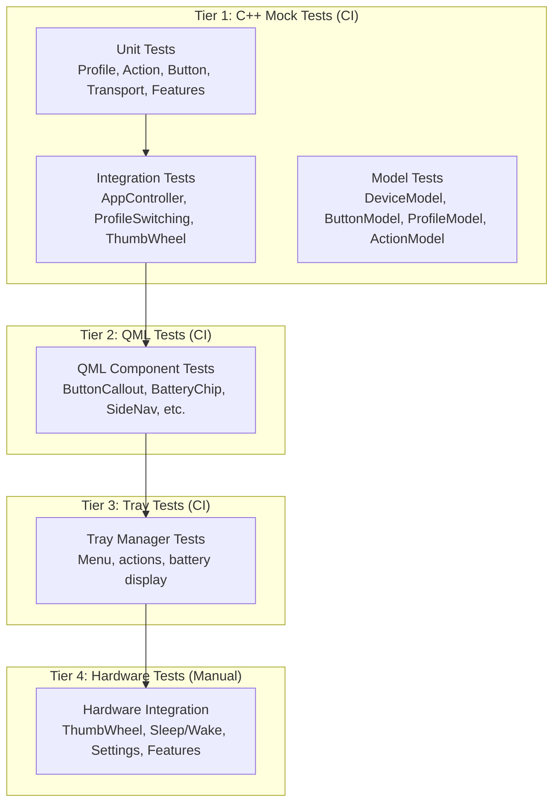
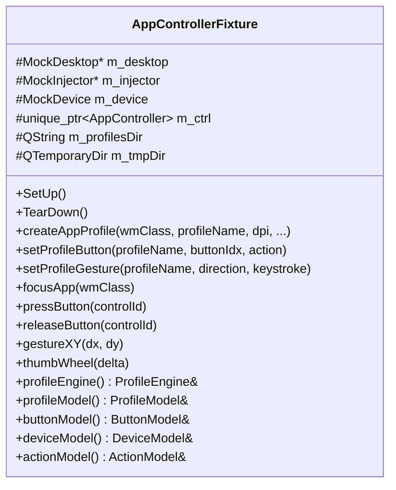
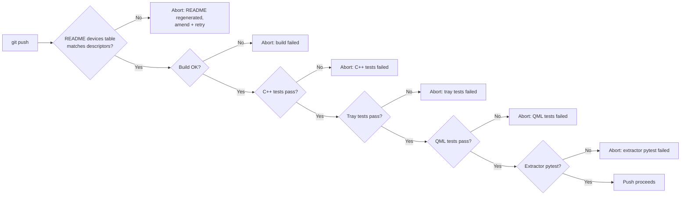

# Testing

## Test Philosophy

Logitune tests are **behavioral, not structural**. Tests verify that features work end-to-end through the real signal chains, not that individual functions return specific values. The principle: **tests fail until the feature works**.

This means:

- Tests exercise `AppController` through its real signal connections (not mocked)
- Tests simulate user actions (focus changes, button presses, UI interactions) and verify the observable results (mock injector calls, profile state, model data)
- The only mocked components are hardware boundaries: `MockDesktop`, `MockInjector`, `MockTransport`, `MockDevice`
- Internal implementation details can change freely without breaking tests

## Test Tiers



| Tier | Binary | Runs In CI | Requires Device | Count |
|------|--------|-----------|----------------|-------|
| C++ Mock | `logitune-tests` | Yes | No | ~40 test files |
| QML | `logitune-qml-tests` | No (pre-push hook only) | No | 15 test files |
| Tray | `logitune-tray-tests` | Yes | No | 1 test file |
| Hardware | `logitune-hw-tests` | No | Yes (MX Master 3S) | 5 test files |

## How to Run

### All Tests

```bash
make test-all
```

This runs all three CI tiers in sequence.

### Individual Tiers

```bash
# C++ unit/integration tests
make test

# QML component tests
make test-qml

# Tray manager tests
make test-tray
```

### Hardware Tests

Hardware tests require `BUILD_HW_TESTING=ON` and a connected device:

```bash
cmake -B build -DBUILD_HW_TESTING=ON
cmake --build build
./build/tests/hw/logitune-hw-tests
```

The `HardwareFixture` waits up to 10 seconds for a device to connect. If no device is found, the test fails with a descriptive message.

### Running Specific Tests

```bash
# Run a single test by name
QT_QPA_PLATFORM=offscreen ./build/tests/logitune-tests --gtest_filter="ProfileSwitchTest.FocusChangeAppliesAppProfile"

# Run all tests matching a pattern
QT_QPA_PLATFORM=offscreen ./build/tests/logitune-tests --gtest_filter="ThumbWheel*"

# List all available tests
QT_QPA_PLATFORM=offscreen ./build/tests/logitune-tests --gtest_list_tests
```

Note: `QT_QPA_PLATFORM=offscreen` is required when running without a display (CI, SSH, containers).

## Test Infrastructure

### AppControllerFixture

`tests/helpers/AppControllerFixture.h` is the primary integration test fixture. It provides:



**SetUp** creates:

1. `MockDesktop` and `MockInjector` (raw pointers, not owned by AppController)
2. `AppController` with injected mocks
3. Temporary profile directory with a seeded `default.conf`
4. `MockDevice` with MX Master 3S controls
5. Sets `thumbWheelDefaultDirection = 1` (neutral, no direction normalization)

**Helper methods**:

| Method | What it does |
|--------|-------------|
| `createAppProfile(wmClass, name, dpi, ...)` | Creates a profile on disk, registers the app binding, adds to ProfileModel |
| `setProfileButton(name, idx, action)` | Modifies a button action in a cached profile |
| `setProfileGesture(name, dir, keystroke)` | Sets a gesture keystroke on a cached profile |
| `focusApp(wmClass)` | Simulates a window focus change through MockDesktop and syncs display profile |
| `pressButton(controlId)` | Simulates a diverted button press |
| `releaseButton(controlId)` | Simulates a diverted button release |
| `gestureXY(dx, dy)` | Feeds raw gesture deltas |
| `thumbWheel(delta)` | Feeds a thumb wheel rotation |

**Friend access**: AppControllerFixture is a `friend` of `AppController`, giving it access to private members for state inspection and direct manipulation (e.g., setting `m_thumbWheelDefaultDirection`).

### MockDesktop

Implements `IDesktopIntegration` with:

- `simulateFocus(wmClass, title)` — emits `activeWindowChanged` signal
- `setRunningApps(apps)` — sets the list returned by `runningApplications()`
- `blockCount()` — tracks how many times `blockGlobalShortcuts()` was called

### MockInjector

Implements `IInputInjector` and records all calls:

- `hasCalled(method)` — check if a method was called (e.g., `"injectKeystroke"`)
- `lastArg(method)` — get the last argument passed to a method
- `calls()` — full call log as `QVector<Call>` (method + arg pairs)
- `clear()` — reset call log

### MockTransport

Implements `ITransport` with:

- `setResponse(featureIndex, report)` — set a canned response for a feature index
- `simulateNotification(report)` — emit `notificationReceived` signal
- `simulateDisconnect()` — emit `deviceDisconnected` signal
- `sentRequests()` — log of all sent requests

### MockDevice

Implements `IDevice` with all fields as public member variables for direct manipulation. Used by `AppControllerFixture` to supply a synthetic device to the controller under test; it is not used for device-descriptor tests (those load real JSON fixtures via `DeviceRegistry`).

### ProfileFixture

A simpler fixture in `tests/helpers/TestFixtures.h` for profile-specific tests. Provides:

- `QTemporaryDir` for profile file I/O
- `makeDefaultProfile()` — returns a pre-populated `Profile` struct
- `ensureApp()` — creates a static `QCoreApplication` (required for Qt event loop)

## Writing a New Test

### Example: Testing a New Feature

Suppose you've added a new "DPI shift" button action that temporarily sets DPI to a low value while held. Here is how you would test it:

#### 1. Choose the right fixture

Since this involves AppController signal flow (button press -> action execution), use `AppControllerFixture`:

```cpp
// tests/test_dpi_shift.cpp
#include "helpers/AppControllerFixture.h"

namespace logitune::test {

class DpiShiftTest : public AppControllerFixture {};

TEST_F(DpiShiftTest, HoldDpiShiftLowersDpi) {
    // Set up: assign DPI shift to button 2 (middle click, CID 0x0052)
    setProfileButton("default", 2, {ButtonAction::DpiShift, "400"});

    // Simulate button press
    pressButton(0x0052);

    // Verify DPI was changed
    // (check DeviceModel or MockInjector depending on implementation)
    EXPECT_EQ(deviceModel().currentDPI(), 400);

    // Simulate button release
    releaseButton(0x0052);

    // Verify DPI restored
    EXPECT_EQ(deviceModel().currentDPI(), 1000);  // default profile DPI
}

TEST_F(DpiShiftTest, DpiShiftUsesHardwareProfile) {
    // DPI shift should use the hardware profile's DPI, not the display profile's
    createAppProfile("firefox", "Firefox", /*dpi=*/2000);
    focusApp("firefox");

    setProfileButton("Firefox", 2, {ButtonAction::DpiShift, "400"});
    pressButton(0x0052);
    EXPECT_EQ(deviceModel().currentDPI(), 400);

    releaseButton(0x0052);
    EXPECT_EQ(deviceModel().currentDPI(), 2000);
}

} // namespace logitune::test
```

#### 2. Add to CMakeLists.txt

```cmake
# In tests/CMakeLists.txt
add_executable(logitune-tests
    # ... existing files ...
    test_dpi_shift.cpp
)
```

#### 3. Run

```bash
cmake --build build
QT_QPA_PLATFORM=offscreen ./build/tests/logitune-tests --gtest_filter="DpiShift*"
```

### Adding a device test

Device tests load a JSON fixture through `DeviceRegistry`; there is no
per-device mock class to extend.

1. Drop a fixture at `tests/fixtures/<slug>/descriptor.json` (plus
   placeholder images if the test exercises image paths).
2. In your test, point `XDG_DATA_HOME` at the directory containing your
   fixture tree and construct a `DeviceRegistry` -- the constructor loads
   all devices it finds under the XDG paths automatically:

    ```cpp
    QTemporaryDir tmp;
    qputenv("XDG_DATA_HOME", tmp.path().toUtf8());
    // copy your fixture into tmp.path() + "/logitune/devices/<slug>/"
    DeviceRegistry registry;
    const IDevice *dev = registry.findBySourcePath(
        tmp.path() + "/logitune/devices/<slug>");
    ASSERT_NE(dev, nullptr);
    ```

3. Use the parameterized `DeviceSpec` pattern in
   `tests/test_device_registry.cpp` for smoke-testing every bundled
   descriptor. Add your device to the `kDevices` array with its
   expected field values.

## Hardware Tests

Hardware tests use `HardwareFixture` (`tests/hw/HardwareFixture.h`) which:

1. Creates a real `DeviceManager` with a real `DeviceRegistry`
2. Calls `start()` and waits for `deviceSetupComplete` signal (up to 10 seconds)
3. Records initial device state (DPI, SmartShift, thumb wheel) in SetUp
4. Restores initial state in TearDown

### Available Hardware Tests

| File | What it tests |
|------|--------------|
| `test_hw_device.cpp` | Device connection, name reading, feature enumeration |
| `test_hw_features.cpp` | Feature calls: battery, DPI, SmartShift read/write |
| `test_hw_thumbwheel.cpp` | ThumbWheel divert/undivert, invert, mode switching |
| `test_hw_settings_readback.cpp` | Write a setting and read it back to verify |
| `test_hw_sleep_wake.cpp` | Sleep detection and re-enumeration |

### HardwareFixture Helpers

| Method | Description |
|--------|-------------|
| `processEvents(ms)` | Spin the Qt event loop for `ms` milliseconds |
| `setThumbWheelModeAndWait(mode, invert)` | Set mode and wait 100ms for async response |
| `verifyThumbWheelStatus(divert, invert)` | Read back ThumbWheel status via HID++ and assert |
| `isButtonDiverted(controlId)` | Read ReprogControlsV4 reporting state |

## QML Tests

QML tests use Qt Quick Test (`qml6-module-qttest`). Each test file is a `.qml` file that creates the component under test and verifies its behavior.

### Test files

| File | Component |
|------|-----------|
| `tst_ButtonCallout.qml` | ButtonCallout interactive overlay |
| `tst_BatteryChip.qml` | Battery level chip display |
| `tst_Toast.qml` | Toast notification popup |
| `tst_DeviceView.qml` | Device view layout |
| `tst_PointScrollPage.qml` | Point & Scroll page controls |
| `tst_SideNav.qml` | Sidebar navigation |
| `tst_SettingsPage.qml` | Settings page |
| `tst_Theme.qml` | Theme singleton |
| `tst_DetailPanel.qml` | Detail panel layout |
| `tst_ButtonsPage.qml` | Buttons page with device render |
| `tst_LogituneToggle.qml` | Toggle switch component |
| `tst_EasySwitchPage.qml` | Easy-Switch page |
| `tst_InfoCallout.qml` | Info callout component |

### QML Test Pattern

QML tests run with `QT_QPA_PLATFORM=offscreen`. A common pattern wraps the component in an `Item` to provide a parent context:

```qml
import QtQuick
import QtTest
import Logitune

TestCase {
    name: "BatteryChipTest"
    when: windowShown

    Item {
        id: wrapper
        width: 200
        height: 50

        BatteryChip {
            id: chip
            level: 75
            charging: false
        }
    }

    function test_displayLevel() {
        compare(chip.level, 75)
    }

    function test_chargingState() {
        chip.charging = true
        // verify visual change
    }
}
```

### mouseClick Pattern

Qt Quick Test's `mouseClick` requires the target item to be within a `Window` or have a valid `parent`. If `mouseClick` fails silently, wrap the component in an `Item` with explicit dimensions.

## Pre-Push Hook

`hooks/pre-push` (auto-activated by `cmake -B build` via `core.hooksPath`) runs five stages before allowing a push:



No install step needed — `cmake -B build` sets `core.hooksPath=hooks` in the repo's local git config during configure, so the tracked `hooks/pre-push` runs automatically on every `git push`.

## CI Pipeline

The GitHub Actions CI workflow (`.github/workflows/ci.yml`) runs on every push to `master` and every pull request:

1. Install dependencies (Qt 6, GTest, libudev) on Ubuntu 24.04
2. Configure CMake with Ninja and `BUILD_TESTING=ON`
3. Build all targets
4. Run C++ tests (`logitune-tests`)
5. Run tray tests (`logitune-tray-tests`)
6. Run QML tests (`logitune-qml-tests`)

All tests run with `QT_QPA_PLATFORM=offscreen` (no display server required).

## Test File Index

### C++ Tests

| File | What it tests |
|------|--------------|
| `test_smoke.cpp` | Basic construction and property access |
| `test_transport.cpp` | Transport send/receive, report serialization |
| `test_feature_dispatcher.cpp` | Feature enumeration, call, callAsync |
| `test_profile_engine.cpp` | Profile load/save, app bindings, diff |
| `test_action_executor.cpp` | Keystroke parsing, action execution |
| `test_features.cpp` | Feature-specific param builders and parsers |
| `test_scroll_features.cpp` | HiResWheel, SmartShift feature logic |
| `test_button_features.cpp` | ReprogControls divert/undivert |
| `test_device_discovery.cpp` | isReceiver, isDirectDevice, deviceIndex |
| `test_device_registry.cpp` | findByPid, findByName, registration |
| `test_smoke_mocks.cpp` | MockDesktop, MockInjector, MockTransport sanity |
| `test_keystroke_parser.cpp` | Keystroke string parsing (Ctrl+C, etc.) |
| `test_button_action.cpp` | ButtonAction serialize/parse |
| `test_button_model.cpp` | ButtonModel roles, setAction, loadFromProfile |
| `test_profile_model.cpp` | ProfileModel add/remove/select, roles |
| `test_action_model.cpp` | ActionModel catalog, indexForName, payloadForName |
| `test_device_model.cpp` | DeviceModel display values, settings relay |
| `test_wmclass_resolution.cpp` | Desktop file resolution logic |
| `test_app_controller.cpp` | AppController init, wireSignals, device setup |
| `test_profile_switching.cpp` | Focus change triggers profile switch |
| `test_profile_persistence.cpp` | Profile save/load round-trip |
| `test_device_reconnect.cpp` | Disconnect/reconnect handling |
| `test_thumb_wheel_behavior.cpp` | Thumb wheel modes, direction, accumulator |
| `test_profile_switch_behavior.cpp` | Display vs hardware profile separation |
| `test_notification_filtering.cpp` | softwareId filtering, notification dispatch |
| `test_settings_change_behavior.cpp` | DPI/SmartShift/scroll change flow |
| `test_tray_manager.cpp` | TrayManager menu, actions, battery display |
| `test_action_filter_model.cpp` | ActionFilterModel hides entries the selected device can't run |
| `test_capability_dispatch.cpp` | HID++ feature-variant capability table resolution |
| `test_descriptor_writer.cpp` | DescriptorWriter round-trip preserves unknown fields |
| `test_editor_model.cpp` | EditorModel mutations, undo/redo, per-device stacks |
| `test_desktop_factory.cpp` | Desktop integration selection based on XDG_CURRENT_DESKTOP |
| `test_device_session.cpp` | Per-transport state machine, feature enumeration |
| `test_physical_device.cpp` | Transport aggregation, primary selection on failover |
| `test_profile_apply_behavior.cpp` | Hardware profile application sequences |
| `test_settings_model.cpp` | SettingsModel persistence and Q_PROPERTY surface |
| `test_json_device.cpp` | JsonDevice::load parsing, schema conformance |
| `test_device_fetcher.cpp` | Async device info fetching (name, serial, firmware) |
| `test_dpi_cycle_ring.cpp` | DPI cycle ring rotation + boundary handling |
| `test_autostart_desktop.cpp` | Autostart .desktop installation (PR #69) |
| `test_distro_detector.cpp` | Distribution detection for packaging hints |

### Crash dialog behavior

Catchable crashes (SIGSEGV, SIGABRT, SIGFPE, SIGBUS, and uncaught C++
exceptions) show the Crash Report dialog at the moment they happen,
via `CrashHandler` installed during startup. The app does not show a
recovery dialog on the next launch: uncatchable exits (SIGKILL, OOM,
power loss, reboot) leave a lock file behind, but the user already
knows those happened, so the lock is silently cleaned up.

When testing crash paths, expect the dialog to appear in the same
session; do not test for a recovery-on-startup dialog.
